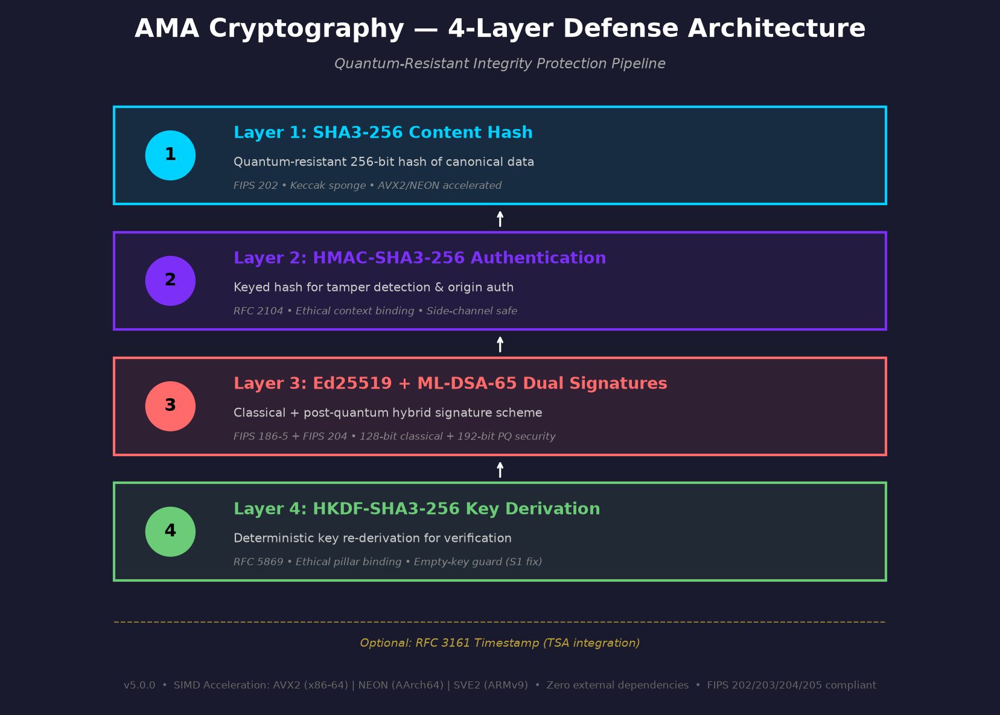
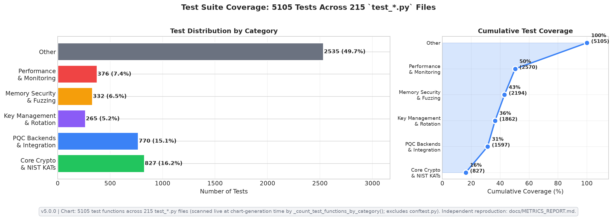
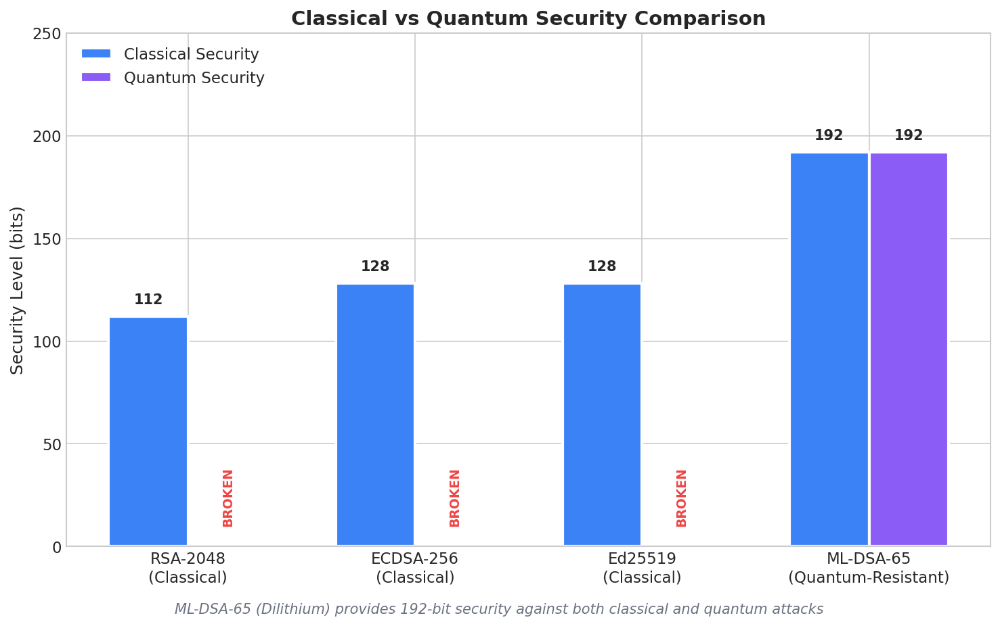
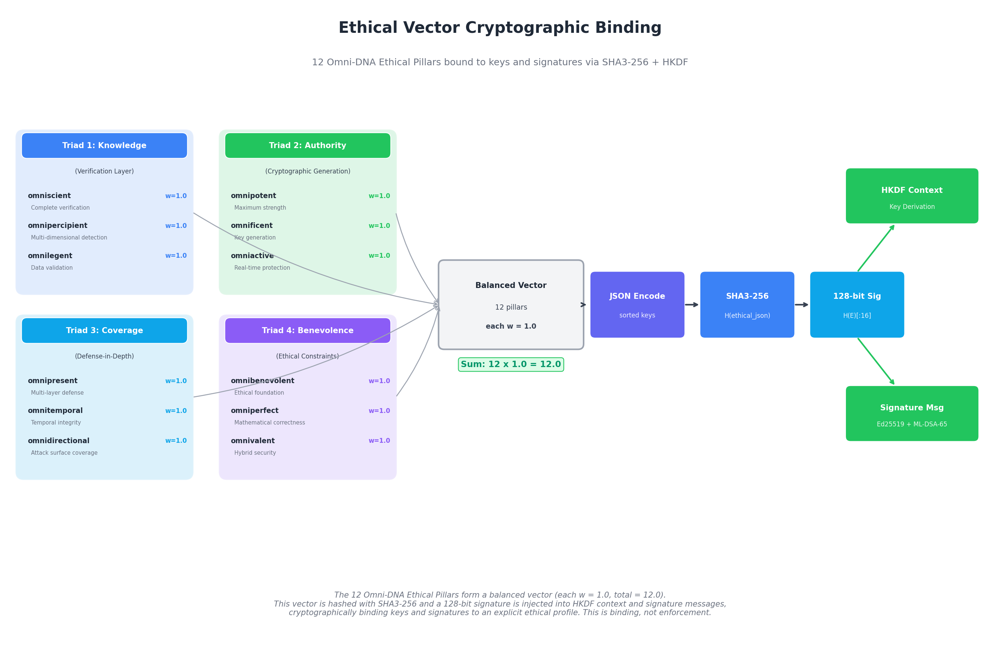

<div align="center">

  


</div>

[](LICENSE)
[](https://www.python.org)
[](https://en.wikipedia.org/wiki/C11_(C_standard_revision))
[](https://cython.org)
[](CRYPTOGRAPHY.md)
[](docs/compliance/ACVP_SELF_ATTESTATION.md)
[](MONITORING.md)
[](ARCHITECTURE.md)

```
              +==============================================================================+
              |                            AMA CRYPTOGRAPHY ♱                                |
              |                       Post-Quantum Security System                           |
              |                                                                              |
              |   Multi-Layer Defense  |   Quantum-Resistant    |   Defense-in-Depth         |
              |   Cython 3R Math       |   3R Anomaly Monitor   |   Cross-Platform           |
              |   HD Key Derivation    |   Algorithm-Agnostic   |   NIST PQC Standards       |
              |                                                                              |
              |   C Layer (Native)     |   Cython Layer         |   Python API               |
              |   ─────────────────    |   ─────────────────    |   ─────────────────        |
              |   SHA3/HKDF/AEAD       |   3R Math (Lyap/NTT)   |   Algorithm-Agnostic       |
              |   ML-DSA/ML-KEM/SLH    |   NumPy Integration    |   Key Management           |
              |   Ed25519/X25519       |   Math Engine          |   3R Monitoring            |
              |   NIST P-curves        |                        |                            |
              |   secp256k1/FROST      |                        |                            |
              |   Ascon/LMS/HSS        |                        |                            |
              |                                                                              |
              |                       Built for a civilized evolution.                       |
              +==============================================================================+
```

**Copyright 2025-2026 Steel Security Advisors LLC**
**Author/Inventor:** Andrew E. A.
**Contact:** steel.sa.llc@gmail.com
**License:** Apache License 2.0
**Version:** 5.0.0
**AI Co-Architects:** Eris ✠ | Eden ♱ | Devin ⚛︎ | Claude ⊛

---

## Executive Summary 🌎

AMA Cryptography is a hybrid Ed25519 + Dilithium (ML-DSA-65) framework for quantum-resistant integrity protection. Community-tested, not externally audited. A multi-language cryptographic security system designed to protect people, data, and networks against both classical and quantum threats. Built on NIST-standardized post-quantum cryptography (PQC), AMA Cryptography provides security-hardened features with measured performance (see [Performance Metrics](#performance-metrics)).

The system combines NIST-standardized post-quantum algorithms with a 3R runtime security monitoring framework, creating a defense-in-depth architecture that provides visibility into cryptographic operations. 3R overhead is not part of the CI regression gate; measure it locally with `python benchmarks/benchmark_suite.py` before relying on an environment-specific figure. The multi-language architecture (C + Cython + Python) pairs constant-time C implementations with optional Cython acceleration for the 3R math engine only. On that specific workload — Lyapunov exponent, NTT-shaped rotation matrix-vector products, and helix evolution kernels in `src/cython/math_engine.pyx` — Cython is 18–37× faster than the pure-Python NumPy baseline on x86-64 (see [`wiki/Performance-Benchmarks.md`](wiki/Performance-Benchmarks.md) for methodology). This speedup is for 3R monitoring math and **does not apply to the C-implemented cryptographic primitives** — those numbers live in [`benchmark-report.md`](benchmark-report.md). Independent security review is recommended before deployment in high-security or regulated environments.

**Protecting people, data, and networks with quantum-resistant cryptography**

> **Design Philosophy:** Built exclusively from standardized cryptographic primitives (NIST FIPS, IETF RFC) — no custom ciphers, hash functions, or signature schemes. The composition protocol — how primitives are combined into the multi-layer defense architecture, double-helix key evolution, and adaptive posture system — is an original design by Steel Security Advisors LLC. AMA Cryptography provides post-quantum cryptography for <a href="https://github.com/Steel-SecAdv-LLC/Mercury-Agent">Mercury Agent</a> and FINDΩYOU™, both of which derive their cryptographic foundation from this library.
>
> **The Trio — Kin Systems:** AMA Cryptography, Mercury Agent, and FINDΩYOU™ form a single civilization-first lineage. Each is independently deployable, but they are designed as kin — sharing the same cryptographic backbone, the same ethical alignment posture, and the same survivor-first mission.
>
> - **AMA Cryptography ♱** — the cryptographic foundation. Hybrid Ed25519 + Dilithium (ML-DSA-65) framework for quantum-resistant integrity protection. Standalone library; any Python project can install and use it independently.
>
> - **Mercury Agent ♱** — a neuro-symbolic autonomous AI prototype built on a 7-phase cognitive architecture (Neural Memory → Symbolic Logic → Hybrid Fusion → Enhanced Detection → Autonomous OODA Agent → Ethical Bounding → Cognitive Evolution). Pairs a cognitive subsystem (`NeuralPredicateEncoder`, `DifferentiableRuleModule`, `NeuralTheoremProver`, `CounterfactualReasoner`) with a 22+ detector ensemble measured across 65 real-world datasets (mean ROC-AUC 0.8464). Every decision is gated by a dual hard-enforcement layer: Benevolence ≥ 0.99 (Gini-equity + empathy + value-preservation) and σ_Immutable (a trained 99.6% val-acc gate over a signed corpus). Designed for STEM exploration, humanitarian crisis response, and civilization-first/AI evolution.
>
> - **FINDΩYOU™** — a near-future addition with a people-first mission: locating the lost, missing, and abducted to reunite families, and accounting for the predators responsible so they answer to justice. A comprehensive, ethical biometric platform — facial, iris, fingerprint, and voice recognition with AgeTransGAN-driven age progression — bound by neuro-symbolic ethical constraints (Logic Tensor Networks) and audited for bias. Integrates real-time emergency channels (FEMA IPAWS Amber Alerts, NOAA, USGS) and operates under geo-consent with strict privacy compliance (BIPA, CCPA/CPRA, GDPR, COPPA). US-focused, survivor-first.
>
> **Integration:** AMA Cryptography is a standalone cryptographic library — any Python project can install and use it independently for quantum-resistant security. The library is designed for general-purpose use across AI agents, AI systems, and any application requiring post-quantum protection.
>
> **Project Philosophy:** Promoting action over inaction in the hope of helping secure critical systems against emerging quantum threats. This project is under active development. While we strive for cryptographic rigor, users should remain cautious and conduct independent security reviews before production deployment. The perceived absence of a threat does not constitute the lack of a threat. Our goal is to deter, mitigate, and elevate security posture — not create new vulnerabilities.

> **Security Disclosure:** This is a self-assessed cryptographic implementation without third-party audit. Production use REQUIRES:
> - FIPS 140-2 Level 3+ HSM for master secrets (no software-only keys in high-security environments)
> - Independent security review by qualified cryptographers
> - Constant-time implementation verification for side-channel resistance
> - Secure file permissions for key files and cryptographic packages (store on encrypted volumes with restricted access)
>
> **Status:** Community-tested | Not externally audited
> **Last Updated:** 2026-08-24

---

## Table of Contents

<details>
<summary><strong>Click to expand navigation</strong></summary>

- [Executive Summary](#executive-summary-)
- [Key Capabilities](#key-capabilities)
- [Use Cases by Sector](#use-cases-by-sector-)
- [Performance Metrics](#performance-metrics)
- [Quick Start](#quick-start)
- [Testing and Quality Assurance](#testing-and-quality-assurance)
- [NIST Algorithm Compliance](#nist-algorithm-compliance)
- [Documentation](#documentation)
- [Cross-Platform Support](#cross-platform-support)
- [Build System](#build-system)
- [Mathematical Foundations](#mathematical-foundations)
- [Contributing](#contributing)
- [Unique Features](#unique-features)
- [License](#license)
- [Contact and Support](#contact-and-support)
- [Acknowledgments](#acknowledgments)
- [Legal Disclaimer & Attribution](#steel-security-advisors-llc--legal-disclaimer--attribution)

</details>

---

## Key Capabilities

<details>
<summary><strong>Problem Statement and Solution</strong></summary>

### The Problem

Current cryptographic systems face three critical challenges:

1. **Quantum Threat**: Traditional cryptography (RSA, ECDSA) is expected to be vulnerable to large-scale quantum computers, with timelines estimated at 5-15+ years (debated)
2. **Black Box Security**: Most cryptographic libraries provide no runtime visibility into side-channel vulnerabilities or anomalous behavior
3. **Performance vs Security Trade-off**: Quantum-resistant algorithms are significantly slower, creating adoption barriers

### The AMA Cryptography Solution

AMA Cryptography addresses all three challenges through:

- **Quantum Resistance**: NIST-standardized ML-DSA-65 (FIPS 204), ML-KEM-1024 (FIPS 203), and SLH-DSA parameter sets (FIPS 205) designed for long-term protection against quantum threats
- **Transparent Security**: 3R monitoring (Resonance-Recursion-Refactoring) provides real-time cryptographic operation analysis
- **Optimized Performance**: Cython acceleration for 3R math engine (manual build required); benchmarked at 18–37x speedup over pure Python mathematical baseline

### Target Use Cases

- **Humanitarian and Conservation**: Crisis response, whistleblower protection, sensitive field data
- **Government and Defense**: Classified data protection with quantum resistance
- **Financial Services**: Transaction security future-proofed against quantum threats
- **Healthcare**: HIPAA-compliant data encryption with audit trails
- **Critical Infrastructure**: SCADA systems requiring long-term quantum-resistant protection
- **Blockchain and Crypto**: Post-quantum secure digital signatures

See [Use Cases by Sector](#use-cases-by-sector-) for detailed scenarios.

</details>

<details>
<summary><strong>Unique Differentiators</strong></summary>

### Multi-Layer Cryptographic Protection Architecture

**Defense-in-depth security** with multiple independent cryptographic layers:

**Core Cryptographic Operations** (the defense layers an attacker must defeat):

| Layer | Protection | Security Level |
|-------|------------|----------------|
| 1. SHA3-256 | Content integrity | 128-bit collision resistance |
| 2. HMAC-SHA3-256 | Keyed message authentication | Authenticated integrity |
| 3. Ed25519 | Classical digital signature | 128-bit classical security |
| 4. ML-DSA-65 | Quantum-resistant digital signature | 192-bit quantum security (FIPS 204) |

**Supporting Cryptographic Infrastructure:**

| Component | Purpose |
|-----------|---------|
| 5. HKDF-SHA3-256 | Key derivation ensuring cryptographic key independence |
| 6. RFC 3161 Timestamping | Timestamp tokens, verified for §2.4.2 message-imprint binding only — not third-party attestation (optional) |

Canonical encoding serves as the input normalization step, ensuring deterministic serialization before cryptographic operations.

**Why defense-in-depth matters:** Overall security is bounded by the weakest cryptographic layer (~128-bit classical, ~192-bit quantum). Defense-in-depth provides continued protection if one layer is compromised. See [CRYPTOGRAPHY.md](CRYPTOGRAPHY.md) for detailed analysis.



*Package authenticity is protected by four independent cryptographic operations — content hashing, keyed authentication, classical signature, and quantum-resistant signature — supported by independent key derivation and optional third-party timestamping.*

### 3R Runtime Security Monitoring

A runtime monitoring framework providing cryptographic operation analysis:

- **Resonance Engine**: FFT-based anomaly detection with frequency-domain analysis (monitors for statistical anomalies, not a timing attack prevention system)
- **Recursion Engine**: Multi-scale hierarchical pattern analysis for anomaly detection
- **Refactoring Engine**: Code complexity metrics for security review

Two optional agentic-abuse detectors (on by default, advisory-only) extend the Resonance and Recursion components against the July 2026 autonomous-agent escape pattern:

- **Volume-spike detector** (`VolumeSpikeDetector`): statistical detection of anomalous KEM/signature bursts, scored in the Anscombe variance-stabilising transform so a quiet baseline cannot manufacture false spikes; an optional key fingerprint separates ephemeral-key churn from a hot loop over one key.
- **Note-like artifact detector** (`NoteArtifactDetector`): surfaces signed payloads shaped like instructions addressed to a later instance ("notes for future versions"). Calibrated against the repository's own text as a hard-negative corpus.

- **Performance overhead**: Not tracked in the CI regression suite; measure locally with `python benchmarks/benchmark_suite.py`
- **Visibility**: Runtime insight into cryptographic operation behavior

> **Note:** The 3R system is a runtime anomaly monitoring framework. It surfaces statistical anomalies for security review but does not guarantee detection or prevention of timing attacks or other side-channel vulnerabilities. The agentic-abuse detectors are advisory heuristics: they flag payloads and bursts for human review and never block a cryptographic operation.
>
> **Measured detection efficacy (`benchmarks/r3_efficacy.tsv`, produced by `benchmarks/r3_efficacy_eval.py`).** On 4,000 real ML-DSA-65 sign timings from one process, with anomalies injected and a trailing-window z-score (|z| > 3 over 100 samples) as the trivial baseline: isolated slow operations at 10x the median were flagged by `ResonanceTimingMonitor` 30% of the time (baseline: 80%) at a false-positive rate of 1.4% (baseline: 1.8%); at 1.5x, 5% (baseline: 26%). A persistent +10% slowdown was detected by both, 3R after 19 samples and the baseline after 47; at +5%, 3R needed 182 samples to the baseline's 47. Read the timing monitor as a regime-change detector, not a per-operation one: for isolated outliers a z-score does better, and nothing here is evidence of timing-attack detection.

### Multi-Language Architecture

Three-layer architecture balancing security and usability:

- **C Layer**: Native SHA3-256, HKDF-SHA3-256, Ed25519, AES-256-GCM, ML-DSA-44/65/87, ML-KEM-512/768/1024, SLH-DSA parameter sets, X25519, ChaCha20-Poly1305, Argon2id, secp256k1, NIST P-256/P-384/P-521, and FROST implementations — zero external production crypto dependencies (see [Implementation Status Matrix](#implementation-status-matrix))
- **Cython Layer**: Optimized 3R mathematical operations (benchmarked at 18–37x vs pure Python mathematical baseline)
- **Python API**: High-level, user-friendly interface for rapid development (primary production API)

### Advanced Features

- Hierarchical Deterministic (HD) key derivation
- Zero-downtime key rotation with lifecycle management
- Algorithm-agnostic API for seamless algorithm switching
- Secure encrypted key storage at rest
- AES-256-GCM authenticated encryption (NIST SP 800-38D)
- Adaptive cryptographic posture system (runtime threat response)
- Hybrid KEM combiner (classical + PQC key encapsulation)
- Agent-instance key/signature binding (INVARIANT-30): cryptographically forbids long-lived persistence material and successor-authorizing signatures unless a human-held operator key authorizes them — domain separation and policy over existing SHA3-256/HMAC-SHA3-256/HKDF, no new algorithms

### Quantum-Resistant Algorithms

NIST-standardized post-quantum algorithms:

- ML-DSA-65 (NIST FIPS 204 - Dilithium)
- ML-KEM-1024 (NIST FIPS 203; Kyber lineage)
- SLH-DSA-SHA2-256f and SLH-DSA-SHAKE-128s (NIST FIPS 205; SPHINCS+ lineage)
- Hybrid classical+PQC modes with binding combiner

</details>

<details>
<summary><strong>Key Achievements</strong></summary>

| Achievement | Description |
|-------------|-------------|
| Defense-in-Depth | Multi-layer cryptographic protection (4 core + 2 supporting) |
| Performance | Cython math engine optimization (18–37x vs pure Python mathematical baseline) |
| Quantum Resistance | NIST-standardized PQC algorithms (ML-DSA-65, ML-KEM-1024, SLH-DSA) |
| Mathematical Foundations | 5 frameworks with machine-precision validation (self-assessed) |
| Cross-Platform | Linux, macOS, Windows, ARM64 |
| Production Infrastructure | Docker, CI/CD, comprehensive testing |
| 3R Monitoring | Runtime security anomaly monitoring; overhead must be measured per environment |

</details>

<a id="implementation-status-matrix"></a>

<details>
<summary><strong>Implementation Status Matrix</strong></summary>

| Algorithm / Family | C API | Python API | Notes |
|---|---|---|---|
| SHA-256, SHA-512 | Full | Full | FIPS 180-4; SHA-256 has an opt-in SHA-NI single-block kernel (`ama_sha256_ni.c`) selected by dispatch |
| SHA3-256 / -512, SHAKE-128 / -256 | Full | Full | FIPS 202; AVX-512 4-way Keccak available opt-in via `-DAMA_ENABLE_AVX512=ON` |
| HMAC-SHA-256 / -384 / -512, HMAC-SHA3-256 | Full | Full | RFC 2104, FIPS 198-1 |
| HKDF (any supported hash) | Full | Full | RFC 5869 |
| AES-256-GCM | Full | Full | SP 800-38D; constant-time bitsliced S-box default; VAES + VPCLMULQDQ YMM kernel selected at runtime when CPUID reports both |
| ChaCha20-Poly1305 | Full | Full | RFC 8439; AVX2 8-way + NEON kernels |
| Ascon-AEAD128 & Ascon-Hash256 | Full | Full | SP 800-232 |
| Argon2id | Full | Full | RFC 9106; `out_len ≤ AMA_ARGON2ID_MAX_TAG_LEN` (1024). Legacy verify-only path (`ama_argon2id_legacy*`) for one-shot migration of hashes from AMA ≤ 2.1.5 |
| Ed25519 | Full | Full | RFC 8032; INVARIANT-26 canonical-S enforced. One in-house backend on every platform (`src/c/ama_ed25519.c` + `src/c/internal/ama_ed25519_ge.h`): radix-2⁵¹ fe51 arithmetic, static signed-5-bit comb base-point tables, Bernstein–Yang safegcd inversion, half-size-scalar verification; x86-64 GCC/Clang builds also instantiate the same group code over the radix-2⁶⁴ MULX+ADX kernel, byte-identical and selectable via `ama_ed25519_set_mulx_override(1)` (not the default — slower at the group level) |
| X25519 | Full | Full | RFC 7748; field arithmetic dispatched fe64 (radix-2⁶⁴ on x86-64 GCC/Clang, promoted to a MULX+ADX asm kernel when CPUID reports BMI2 ∧ ADX) → fe51 (radix-2⁵¹, non-x86-64 64-bit) → gf16 (radix-2¹⁶, 32-bit and MSVC). u-coordinates canonicalised (INVARIANT-27); low-order outputs rejected (INVARIANT-21); batch API `ama_x25519_scalarmult_batch` available; opt-in AVX2 4-way ladder |
| NIST P-256 / P-384 / P-521 | Full | Full | FIPS 186-5 ECDSA + SP 800-56A ECDH; TLS/X.509/JOSE/COSE/WebAuthn interop. P-256 4-limb Montgomery MULX+ADCX/ADOX kernel; P-384/P-521 use the generic multi-limb CIOS path constant-folded to their limb counts. Strict minimal-DER with `r`,`s` in `[1, n-1]` unconditional; RFC 6979 `s` emitted verbatim and either representative accepted by default, low-`s` opt-in via `AMA_NISTP_ECDSA_SIGN_LOW_S` / `AMA_NISTP_ECDSA_REQUIRE_LOW_S` (INVARIANT-34); canonical field-element pubkey coordinates (INVARIANT-29). See [docs/NIST_PRIME_CURVES.md](docs/NIST_PRIME_CURVES.md) |
| secp256k1 | Full | Full | RFC 6979 deterministic ECDSA; fixed-base comb over the compile-time generator (4-block, 16 entries) — pubkey derivation and signing scalar multiplications use the comb; caller-supplied bases keep the constant-time Montgomery ladder |
| ML-KEM-512 / -768 / -1024 | Full (native) | Full | FIPS 203; Fujisaki–Okamoto transform, IND-CCA2; NTT q=3329 |
| ML-DSA-44 / -65 / -87 | Full (native) | Full | FIPS 204; NTT q=8380417; constant-time NTT/arithmetic; signing's rejection-sampling loop has intentional timing variation by design (leaks no private-key material) |
| SLH-DSA-SHA2-256f | Full (native) | Full | FIPS 205; WOTS+ / FORS / hypertree d=17 |
| SLH-DSA-SHAKE-128s | Full (native) | Full | FIPS 205 |
| LMS / HSS verify | Full | Full | SP 800-208; verification and parameter reads (`ama_lms_verify`, `ama_hss_verify`, `ama_lms_signature_length`, `ama_hss_pubkey_levels`) — signing is not exposed at the Python layer |
| FROST-Ed25519 (RFC 9591-style) | Full | Full | Trusted-dealer keygen, two-round commit / sign, aggregate. Protocol structure per RFC 9591; hash derivations are library-internal (no ciphersuite contextString), so partial signatures interoperate only between AMA participants — the aggregated signature verifies as standard RFC 8032 Ed25519 anywhere |
| Hybrid Ed25519 + ML-DSA-65 | N/A | Full | See `ama_cryptography.hybrid_combiner` (INVARIANT-19) |
| Key formats — PKCS#8 / SPKI / PEM / JWK / COSE_Key | N/A | Full | 12 algorithms: Ed25519, X25519, P-256/-384/-521, secp256k1, ML-DSA-44/-65/-87, ML-KEM-512/-768/-1024. See [docs/KEY_FORMATS.md](docs/KEY_FORMATS.md) |

> All PQC operations run through the native C library. No external PQC dependency (liboqs, pqcrypto) is present or required. Build with `cmake -B build -DAMA_USE_NATIVE_PQC=ON && cmake --build build`.

### C library inventory (v5.0.0)

Top-level `src/c/*.c` — 28 translation units:

`ama_aes_bitsliced.c`, `ama_aes_gcm.c`, `ama_agent_binding.c`, `ama_argon2.c`, `ama_ascon.c`, `ama_chacha20poly1305.c`, `ama_consttime.c`, `ama_core.c`, `ama_cpuid.c`, `ama_dilithium.c`, `ama_ed25519.c`, `ama_frost.c`, `ama_hkdf.c`, `ama_hmac_sha256.c`, `ama_hmac_sha384.c`, `ama_kyber.c`, `ama_lms.c`, `ama_nistp.c`, `ama_pbkdf2.c`, `ama_platform_rand.c`, `ama_secp256k1.c`, `ama_secure_memory.c`, `ama_sha256.c`, `ama_sha256_ni.c`, `ama_sha3.c`, `ama_sha512.c`, `ama_slhdsa.c`, `ama_x25519.c`.

Public headers under `include/` — 4: `ama_cryptography.h` (top-level API), `ama_cpuid.h`, `ama_dispatch.h`, `ama_uint128.h`.

Additional C sources:

- `src/c/dispatch/ama_dispatch.c` — runtime CPU-feature detection and function-pointer dispatch. On x86 the SHA-3 slot promotes to the AVX-512 kernel when `AMA_ENABLE_AVX512=ON` at build time and `ama_cpuid_has_avx512_keccak()` (AVX-512F + AVX-512VL + XCR0 5+6+7) holds at runtime; every other x86 slot ceiling is AVX2. On AArch64 the order is SVE2 → NEON → generic (for the three slots wired to SVE2; see below). Best-of-5 SHA-3 auto-tune with a 10 % revert threshold. Overrides: `AMA_DISPATCH_NO_AUTOTUNE=1`, `AMA_DISPATCH_VERBOSE=1`.
- `src/c/x86/` (3 files) — `ama_keccak_f1600_bmi.c` (Keccak-f[1600] BMI1/BMI2 kernel where `ANDN` collapses chi's `(~b) & c`); `ama_nistp_mont_mulx.c` (P-256 4-limb MULX+ADCX/ADOX Montgomery multiply); `ama_ed25519_fe64_mulx.c` (the radix-2^64 MULX+ADX instantiation of the Ed25519 group arithmetic, selectable through `ama_ed25519_set_mulx_override(1)`).
- `src/c/internal/` — 1 `.c`: `ama_x25519_fe64_mulx.c` (fe64 multiply / square / reduce with `MULX` + `ADCX` + `ADOX` dual-carry chains); 15 `.h`: `ama_ct_barrier.h` (compiler barrier that keeps constant-time selects from being branch-optimized), `ama_ed25519_backend.h` (hidden prototypes of the MULX instantiation), `ama_ed25519_canonical.h`, `ama_ed25519_ge.h` (the Ed25519 group-arithmetic template both field instantiations compile), `ama_ed25519_halfsize.h` (half-size-scalar decomposition for verify), `ama_ed25519_tables.h` (generated static base-point tables), `ama_fe25519_safegcd.h` (Bernstein–Yang constant-time inversion), `ama_fe64_mulx_kernel.h` (the fused MULX/ADX multiply and square, shared by X25519 and Ed25519), `ama_keccak_round.h` (macro-based round header shared by scalar / BMI paths), `ama_once.h` (platform once-primitive for INVARIANT-15), `ama_sha2.h` (SHA-512 header-only), `ama_sha3_x4.h` (4-way Keccak interface), `ama_testing_exports.h` (visibility macro that exposes internals to the C test suite only), `ama_wide_mul.h` (64×64→128 multiply on every toolchain), `ama_x25519_fe64_mulx.h` (the prototypes for the `.c` above).

### Hand-written SIMD kernels — 26 translation units

**AVX2 (`src/c/avx2/`, 10 files):** SHA3 4-way Keccak-f[1600], ML-KEM (NTT / Barrett / batch CBD2), ML-DSA (NTT q=8380417 / batch SHAKE rejection), SPHINCS+ 4-way SHA-256, AES-256-GCM pipelined AES-NI + PCLMULQDQ GHASH with H^1..H^8 power-table folding and deferred one-iteration GHASH pipeline, VAES + VPCLMULQDQ YMM AES-256-GCM (`ama_aes_gcm_vaes_avx2.c` — gated by `ama_cpuid_has_vaes_aesgcm()`), ChaCha20-Poly1305 8-way, Argon2 4-way BlaMka, X25519 4-way ladder (`ama_x25519_avx2.c` — opt-in via `AMA_DISPATCH_USE_X25519_AVX2=1`; intentionally not the default on MULX/ADX hosts, retained for CI matrix coverage and a future AVX-512-IFMA port), and the Ed25519 comb's constant-time 256-bit table fold (`ama_ed25519_select_avx2.c` — dispatched on `ama_has_avx2()`).

**AVX-512 (`src/c/avx512/`, 1 file, opt-in via `-DAMA_ENABLE_AVX512=ON`):** EVEX-encoded YMM-width 4-way Keccak permutation (`ama_sha3_x4_avx512.c` — `vprolq` for the 64-bit rotate, `vpternlogq` for the theta `0x96` and chi `0xD2` collapses). No ZMM register touched. XCR0 5+6+7-gated so an EVEX YMM op cannot `#UD` on a host whose hypervisor advertises CPUID without the ZMM save area. See [docs/AVX512_KECCAK_ADR.md](docs/AVX512_KECCAK_ADR.md).

**NEON (`src/c/neon/`, 8 files):** ARM NEON 128-bit vector equivalents using `<arm_neon.h>` intrinsics + ARM Crypto Extensions — Ed25519, ML-KEM, ML-DSA, SPHINCS+, SHA3, AES-GCM, ChaCha20-Poly1305, Argon2.

**SVE2 (`src/c/sve2/`, 8 files): three wired via dispatch**, their externs in `src/c/dispatch/ama_dispatch.c`. Two are genuine scalable-vector kernels — ML-KEM NTT trio + pointwise/add/sub/reduce (`ama_kyber_sve2.c`) and ML-DSA NTT trio (`ama_dilithium_sve2.c`): VL-agnostic `svwhilelt`-predicated load/store/add/sub, with the modular (Montgomery/Barrett) reductions done scalar — each file's header states the split. The third, SHA3/Keccak (`ama_sha3_sve2.c`), is wired and auto-tuned but its `ama_keccak_f1600_sve2` is a **scalar** permutation, not a vector one: a correctly strip-mined VL-agnostic theta measured slower than scalar at every vector length (a 5-element column-parity reduction cannot fill a vector), so the SVE intrinsics were removed and the file documents it. The remaining five (`ama_aes_gcm_sve2.c`, `ama_chacha20poly1305_sve2.c`, `ama_argon2_sve2.c`, `ama_sphincs_sve2.c`, `ama_ed25519_sve2.c`) are documented placeholders — their per-file headers state the specific reason each cannot be wired today (dispatch-signature mismatch, algorithmic non-conformance to RFC 9106 BlaMka, absent dispatch surface, no production batched caller) and the preconditions a future kernel must meet. Until those hold, SVE2 hosts dispatch those five algorithms to the validated NEON kernels — a strict upgrade over the generic-C fallback.

### Cython modules (`src/cython/`, 7 files)

- `hmac_binding.pyx`, `sha3_binding.pyx`, `hkdf_binding.pyx`, `ed25519_binding.pyx`, `dilithium_binding.pyx` — thin FFI bindings that call the native C entry points with no per-call ctypes overhead. `ctypes` fallback is used when the extension is not built.
- `math_engine.pyx` — the 3R monitoring math kernels (Lyapunov exponent, NTT-shaped rotation matrix-vector products, helix evolution). 18–37× over the pure-Python NumPy baseline (see [`wiki/Performance-Benchmarks.md`](wiki/Performance-Benchmarks.md) for methodology). **This speedup does not apply to the C-implemented cryptographic primitives.**
- `helix_engine_complete.pyx` — a complete-engine reference implementation of all 18+ variants. It is **not** compiled by the default build (`setup.py` builds `math_engine.pyx` and the FFI bindings above, not this file); `math_engine.pyx` is the acceleration that actually ships.

### Python package (`ama_cryptography/`, 27 modules + `__init__` + `__main__`)

`crypto_api` (algorithm-agnostic top-level API + `AlgorithmType`), `pqc_backends` (native C bindings for every primitive), `key_formats` (PKCS#8 / SPKI / PEM / JWK / COSE_Key across 12 algorithms), `key_management`, `hybrid_combiner`, `adaptive_posture`, `agent_binding`, `session`, `secure_channel`, `secure_memory`, `integrity`, `equations`, `double_helix_engine`, `monitor`, `monitoring`, `ascon`, `rfc3161_timestamp`, `legacy_compat`, `exceptions`, `_self_test`, `_asn1`, `_artefact_source`, `_build_sign`, `_integrity_signature`, `_finalizer_health`, `_module_state`, `_numeric`, `__main__`.

</details>

---

## Use Cases by Sector 🌐

> **Research Areas:** The use cases below represent targeted applications where AMA Cryptography's quantum-resistant cryptography may provide value. These implementations require independent validation before deployment in regulated, clinical, or mission-critical environments.

<details>
<summary><strong>Real-world scenarios (click to expand)</strong></summary>

### Humanitarian and Conservation

**Unique Value:** Protection of sensitive field data with runtime attack detection (Not approved for clinical, medical, or regulated government deployment without independent audit):

- **Crisis Response**: GPS coordinates, victim data, and safe house locations protected with ML-DSA-65 quantum-resistant signatures. 3R monitoring surfaces timing anomalies that may indicate compromise in hostile environments.
- **Conservation**: Wildlife tracking data, ranger locations, and anti-poaching intelligence with integrity verification using helical invariants. Detects if data has been tampered with.
- **Whistleblower Protection**: Document signing and verification designed to resist "harvest now, decrypt later" quantum threats.
- **Sensitive Record Preservation**: Ethical framework promotes respectful handling of records for victims and individuals, with audit trails.

### Government and Defense

**Unique Value:** Classified data with quantum resistance and runtime anomaly monitoring

- **Long-term Classified Data**: Documents requiring long-term secrecy protected with quantum-resistant algorithms.
- **Secure Communications**: ML-KEM-1024 key encapsulation designed to resist "harvest now, decrypt later" attacks.
- **Runtime Anomaly Monitoring**: 3R monitoring surfaces statistical anomalies in operation timing that may be consistent with cache-timing or power-analysis behavior, but does not guarantee detection or prevention of timing attacks or other side-channel vulnerabilities.
- **Integrity Verification**: Mathematical invariant checking provides additional tampering detection beyond standard checksums.
- **Zero-Trust Environments**: Runtime monitoring provides continuous observation of cryptographic operations.

### Financial Services

**Unique Value:** Transaction security with real-time anomaly detection

- **Quantum-Resistant Signatures**: ML-DSA-65 signatures on transactions designed to remain valid against quantum attacks.
- **Low-Latency Verification**: Cython-optimized 3R monitoring (18–37x speedup vs pure Python math baseline when built) with sub-millisecond signature verification.
- **Anomaly Detection**: 3R timing analysis surfaces anomalous cryptographic behavior that may indicate potential attacks.
- **Audit Compliance**: Cryptographic audit trail with ethical constraint enforcement.
- **Long-term Archival**: Financial records with quantum-resistant protection for long-term security.

### Healthcare

**Unique Value:** Quantum-resistant encryption with integrity monitoring (independent compliance validation required for HIPAA and other regulations)

- **Patient Records**: Quantum-resistant encryption designed to protect medical records against long-term cryptanalytic threats.
- **Prescription Signatures**: ML-DSA-65 digital signatures on prescriptions providing quantum-resistant authenticity.
- **Medical Device Security**: Constant-time C implementations aim to reduce side-channel attack surface (requires independent verification).
- **Data Integrity**: Helical invariant verification detects if medical records have been altered.
- **Research Data**: Sensitive research data with ethical policy enforcement and audit trails.
- **Telemedicine**: Secure video consultations with hybrid classical+quantum key exchange.

### Critical Infrastructure

**Unique Value:** SCADA/ICS security with runtime anomaly monitoring

- **Power Grid Control**: Quantum-resistant authentication for grid control systems.
- **Water Treatment**: Signed commands with runtime verification. 3R surfaces timing anomalies that may warrant investigation.
- **Transportation**: Railway and air traffic control with quantum-resistant protection for long-lived systems.
- **Nuclear Facilities**: Constant-time C implementations aim to reduce side-channel attack surface (requires independent verification for high-assurance environments).
- **Anomaly Monitoring**: 3R system surfaces statistical anomalies in cryptographic operations for security review.
- **Legacy System Protection**: Wrapper for older systems needing quantum resistance without full replacement.

### Blockchain and Cryptocurrency

**Unique Value:** Post-quantum secure signatures with high-performance verification

- **Wallet Security**: ML-DSA-65 quantum-resistant signatures for wallet transaction authentication.
- **Smart Contract Signing**: Quantum-resistant signatures for long-lived contracts.
- **Transaction Throughput**: Sub-millisecond Ed25519 verification (~21k ops/sec via ctypes on canonical bench, 2026-04-26); ML-DSA-65 adds quantum resistance at higher latency (~336µs sign, ~132µs verify — Python API via ctypes, canonical bench host; see Performance Metrics section for methodology).
- **Cross-Chain Bridges**: Hybrid signing (Ed25519 + ML-DSA-65) for backward compatibility and quantum resistance.
- **NFT Provenance**: Quantum-resistant signatures designed for long-term validity.
- **Timestamp Binding**: RFC 3161 tokens bound to content by the §2.4.2 message imprint. AMA does not verify the TSA's signature or certificate chain, so the token's issuer must be trusted through a separate control.

</details>

---

## Performance Metrics

> **Reading the numbers below.** All ops/sec figures in the tables that follow are from the **canonical bench host** (Linux x86-64 with AVX-512F/VL/BW/DQ/VBMI + VAES + VPCLMULQDQ; Sapphire Rapids / Zen 4 class), measured 2026-04-25 to 2026-04-27 with `python benchmarks/benchmark_runner.py` and `build/bin/benchmark_c_raw --json`. They describe **that host**, not a runner you are likely to have; reproduce them on equivalent silicon.
>
> **What 5.0.0 changed, stated rather than implied.** The canonical-host figures below were measured against the 4.x code. 5.0.0 rewrote the Python one-shot AEAD wrappers (a hand-written multi-buffer borrow plus an all-`bytes` fast path, replacing four `@contextlib.contextmanager` borrows per call), so the **AES-256-GCM and ChaCha20-Poly1305 rows describe a code path this release replaced** and understate it. Measured on the `ubuntu-24.04-arm` CI runner across the change: AES-256-GCM one-shot 132k → 234k ops/sec; ChaCha20-Poly1305 195k, against 207k before it also gained the wipeable-key contract it alone lacked — the ~6% being the shared fast-path scaffolding, stated rather than hidden. The keygen rows are affected in the other direction and are **optimistic**: 5.0.0 runs a FIPS 140-3 pairwise consistency test on every asymmetric keygen (INVARIANT-41), so each of those rows now pays a sign and a verify it did not pay when it was measured — using this table's own figures, that is roughly 3.7x the Ed25519 keygen cost itself. Every row also pays the ~37 ns `check_crypto_permitted()` guard 5.0.0 added to each gated native entry point (INVARIANT-39), which is measurable only on the shortest operations. Read the AEAD rows as understating this release, the keygen rows as overstating it, and no row as a 5.0.0 measurement.
>
> **Every canonical-host row below is a 4.x-era measurement**, dated 2026-04 per row (Core Cryptographic Primitives table) or per table caption (the three tables above it). No 5.0.0 measurement on AVX-512 + VAES + VPCLMULQDQ silicon exists: the canonical bench host is not reachable from CI or from the environment this release was engineered in, and this repository does not publish numbers it did not measure. An earlier revision of this paragraph said the canonical rows are "re-measured on the canonical host at release time" — the date labels on every row contradicted it, and the sentence is withdrawn. Re-measuring on canonical silicon is a release-time action on hardware (tracked in the release PR's *Remaining actions*); until it happens, read every row as a measurement of the 4.x code, adjusted by the paragraph above for the paths 5.0.0 changed.
>
> **Where the current, per-runner numbers live.** `benchmarks/baseline.json` and `benchmarks/arm-baseline.json` carry **measured medians** on their named CI runners with a single derived tolerance each — they are regression *floors*, and since 5.0.0 they are no longer pre-discounted guesses (`x86` uses the slow-class median of a measurably two-class `ubuntu-latest` fleet with a uniform 45% tolerance; `aarch64`, a homogeneous fleet with spreads ≤3%, uses 15% — 25% for the two rejection-averaged composites). `benchmark-report.md` is regenerated from a run of the suite and records the exact commit, host, command, repeat count and aggregation. A floor and a canonical-host figure are different numbers on purpose; neither is an estimate of the other.

<details>
<summary><strong>Cryptographic Operation Benchmarks</strong></summary>


*Multi-panel performance dashboard showing cryptographic throughput, signature latency, scalability, key generation speed, multi-layer breakdown, regression analysis, validation claims, and hybrid performance — all from real benchmark data.*

### ML-DSA-65 (Post-Quantum Digital Signatures — FIPS 204)

| Operation | Throughput (Python API via ctypes) | Latency | Notes |
|-----------|-----------|---------|-------|
| **KeyGen** | 3,626 ops/sec | ~276µs | Native C, NTT q=8380417 |
| **Sign** | 2,976 ops/sec | ~336µs | Rejection sampling — intentional, by-design timing variation (leaks no key); NTT/arithmetic constant-time |
| **Verify** | 7,576 ops/sec | ~132µs | Verified against NIST ACVP test vectors (self-attested) |

*Source: canonical bench host (Linux x86-64 with AVX-512F/VL/BW/DQ/VBMI + VAES + VPCLMULQDQ), measured 2026-04-25. Reproducible with `python benchmarks/benchmark_runner.py` and `build/bin/benchmark_c_raw --json` on equivalent silicon (~4,845 KeyGen, ~3,929 Sign, ~7,773 Verify ops/sec raw C, no ctypes). The checked-in `benchmarks/benchmark-results.json` carries a measured run on the host its own provenance names plus the slow-runner CI regression floors in `baseline_value` — neither column is these canonical numbers; see [CHANGELOG.md](CHANGELOG.md#300---2026-04-27) and [docs/BENCHMARK_HISTORY.md](docs/BENCHMARK_HISTORY.md) for the dual-host methodology.*

### ML-KEM-1024 (Post-Quantum Key Encapsulation — FIPS 203)

| Operation | Throughput (Python API via ctypes) | Notes |
|-----------|-----------|-------|
| **KeyGen** | 4,965 ops/sec | Native C, no OpenSSL dependency |
| **Encapsulate** | 10,253 ops/sec | Fujisaki–Okamoto transform, IND-CCA2 |

*Source: canonical bench host, measured 2026-04-25. Decapsulate and raw C throughput available via `build/bin/benchmark_c_raw --json` (~10,834 Decaps ops/sec on the same host). The checked-in `benchmarks/benchmark-results.json` carries a measured run on the host its own provenance names plus the slow-runner CI regression floors in `baseline_value` — neither column is these canonical numbers.*

### Full Multi-Layer Package Performance

Complete security package with all defense layers (Python API via ctypes):

| Operation | Throughput | Latency |
|-----------|-----------|----------|
| Package Create (all layers) | 2,853 ops/sec | ~350µs |
| Package Verify (all layers) | 4,973 ops/sec | ~201µs |

*Source: canonical bench host, measured 2026-04-25. The checked-in `benchmarks/benchmark-results.json` carries a measured run on the host its own provenance names plus the slow-runner CI regression floors in `baseline_value`, not these canonical numbers (see [CHANGELOG.md](CHANGELOG.md#300---2026-04-27) §"Slow-runner regression-floor recalibration").*

**All Layers:** SHA3-256, HMAC-SHA3-256, Ed25519, ML-DSA-65 (core), HKDF, RFC 3161 (supporting)

### Core Cryptographic Primitives (Python API via ctypes)

| Operation | Throughput | Source |
|-----------|-----------|--------|
| SHA3-256 (1KB) | 184,112 ops/sec | canonical bench, 2026-04-26 |
| HMAC-SHA3-256 (1KB) | 115,408 ops/sec | canonical bench, 2026-04-26 |
| HKDF-SHA3-256 (3-key derive) | 81,703 ops/sec | canonical bench, 2026-04-26 |
| Ed25519 KeyGen | 55,716 ops/sec | canonical bench, 2026-04-26 |
| Ed25519 Sign | 51,488 ops/sec | canonical bench, 2026-04-26 |
| Ed25519 Verify | 21,338 ops/sec | canonical bench, 2026-04-26 |
| AES-256-GCM Encrypt (1KB) | 293,143 ops/sec | canonical bench, 2026-04-26 |
| ChaCha20-Poly1305 Encrypt (1KB) | 256,249 ops/sec | canonical bench, 2026-04-26 |
| X25519 Scalar-mult (fe64 + MULX+ADX kernel) | 15,401 ops/sec | canonical bench, 2026-04-27 |

**Performance Note:** Ed25519 signing stores the expanded 64-byte key (seed||pk) to avoid redundant SHA-512 expansion on each sign call. X25519 now uses the radix-2^64 (`fe64.h`) field arithmetic on x86-64 GCC/Clang (default) with the radix-2^51 (`fe51.h`) layout retained as a fallback for non-x86-64 64-bit GCC/Clang and the portable radix-2^16 path retained for MSVC and 32-bit targets. On hosts where CPUID reports both BMI2 (`EBX[8]`) and ADX (`EBX[19]`), the dispatcher promotes the ladder's multiply / square *and* the Fermat inversion to the in-house MULX+ADCX/ADOX kernel in `src/c/internal/ama_x25519_fe64_mulx.c` — gated by `ama_cpuid_has_x25519_mulx()` and pinned byte-identical to the pure-C fe64 reference across 4096 random vectors by `tests/c/test_x25519_fe64_mulx_equiv.c`. The kernel is hand-written GCC inline assembly: `fe64_mul512_mulx` issues explicit `ADCX` (CF chain) and `ADOX` (OF chain) so the lo-column and hi-column accumulations propagate in parallel, and `fe64_sq512_mulx` is a dedicated squaring kernel that exploits off-diagonal symmetry (10 multiplications vs 16 for the full schoolbook). The wiring is correctness-equivalent across all three field paths (verified by 1024 random vectors in `tests/c/test_x25519_field_equiv.c`); on this canonical-host VM the MULX+ADX kernel improves throughput from the pure-C fe64 baseline of ~11,500 ops/sec to ~15,401 ops/sec via the Python-via-ctypes harness in `benchmarks/benchmark_runner.py` (~34 %); the raw-C harness `build/bin/benchmark_c_raw` measures ~16,983 ops/sec on the same host, with the gap being per-call FFI overhead, not field-arithmetic difference. The literature-reported 1.8-2.2× over pure-C schoolbook (OpenSSL `crypto/ec/asm/x25519-x86_64.pl`, BoringSSL fiat-crypto MULX/ADX) shows up on uncontended Skylake+/Zen+ silicon; the dispatcher lights this kernel up automatically wherever BMI2+ADX are reported, so heavier-iron hosts reach the upper end without further code changes. See [benchmarks/](benchmarks/) for full performance data including all algorithms.

*Benchmarks: Linux x86-64, Python 3.11.15, native C backend via ctypes, measured 2026-04-27. Reproducible via `python benchmarks/benchmark_runner.py` (CI regression suite), `python benchmarks/benchmark_suite.py` (Python-API sweep), or `build/bin/benchmark_c_raw --json` (raw C). Absolute numbers depend on the host; consult [docs/BENCHMARK_HISTORY.md](docs/BENCHMARK_HISTORY.md) for baseline-change policy.*


### secp256k1 Fixed-Base Comb (2026-07-29)

Public-key derivation and the ECDSA signing nonce both compute `d·G` against the compile-time generator. A 4-block fixed-base comb (16 entries, ~1.9 KB, L1-resident) replaces 256 doublings + 256 additions with 64 of each. Measured on the sandbox host (raw C):

- Public-key derivation: **354.97 µs → 83.36 µs (4.26×)**
- ECDSA signing: **392.94 µs → 125.54 µs (3.13×)**
- ECDSA verification: unchanged — already variable-time by design (Shamir's trick).

`ama_secp256k1_point_mul` (caller-supplied base) keeps the constant-time Montgomery ladder. Constant-time preserved: scalar read at fixed indices, table read by masked full-table scan. Welch's t-test over 60,000 samples: **|t| = 0.29** fixed-vs-random and **|t| = 1.03** on a Hamming-weight split, against dudect's 4.5 threshold. See [`docs/BENCHMARK_HISTORY.md`](docs/BENCHMARK_HISTORY.md).

### Benchmark Charts

| Chart | Description |
|-------|-------------|
|  | Signature algorithm throughput and latency (includes SLH-DSA Verify + secp256k1) |
|  | Native C vs Python performance comparison |
|  | Per-layer timing breakdown of the 4-layer defense |
|  | ML-KEM-1024 key encapsulation benchmarks |
|  | Package creation scalability across data sizes |
|  | 2×2 collage of the 2026-05 coverage expansion: X25519 MULX/ADX kernel on-vs-off, ML-DSA-65 NTT/invNTT scalar-vs-dispatched, signature-family sign latency (log), and FROST 2-of-3 per-role cost |

*Charts generated by `python benchmarks/generate_charts.py` with a professional dark theme. The X25519 MULX on/off panel of the PQC Benchmark Overview collage is regenerated from the raw-C harness output (`benchmarks/benchmark_c_raw_results.json`) when present; the other three panels of that collage (ML-DSA-65 NTT/invNTT, signature-family sign latency, FROST 2-of-3) and the remaining standalone charts render from anchored measurement constants checked in alongside the generator. The anchors are refreshed whenever the published numbers change so the charts track the documented measurements without requiring a local benchmark run.*

</details>

<details>
<summary><strong>Cython Optimization Results</strong></summary>

| Operation | Pure Python | Cython | Speedup |
|-----------|-------------|--------|---------|
| Lyapunov function | 12.3ms | 0.45ms | **27.3x** |
| Matrix-vector (500x500) | 8.7ms | 0.31ms | **28.1x** |
| NTT (degree 256) | 45.2ms | 1.2ms | **37.7x** |
| Helix evolution | 3.4ms | 0.18ms | **18.9x** |

**Cython optimization: 18–37x speedup vs pure Python mathematical baseline** (Lyapunov, NTT, helix computations — does not affect C-implemented cryptographic primitives)

</details>

<details>
<summary><strong>Scalability Analysis</strong></summary>

Scalability across input sizes is not yet tracked in the CI regression suite. Measure locally:

```bash
python benchmarks/benchmark_suite.py   # varies message size automatically
```

</details>

<details>
<summary><strong>Ethical Integration Overhead</strong></summary>

Ethical integration overhead is not tracked in the CI regression suite. The ethical layer adds cryptographic binding to the 4 Omni-Code Ethical Pillars via HKDF context. End-to-end package creation overhead depends on host, build flags, and workload; measure locally before quoting a percentage:

```bash
python benchmarks/benchmark_suite.py   # includes ethical overhead breakdown
```

</details>

---

## Quick Start

<details>
<summary><strong>Installation</strong></summary>

### Distribution Channels

AMA Cryptography is distributed from **its own repository first**. No package
index is a required part of the supply chain: the library itself has zero
runtime cryptographic dependencies (INVARIANT-1), so a package index is a
delivery convenience, never an architectural dependency. Every channel below
installs byte-identical source.

| Channel | Status | Needs a C toolchain? |
|---|---|---|
| Source install from a git tag | **Verified working today** | Yes |
| Prebuilt wheel from a GitHub Release | From the first release built by `release.yml` onward | No |
| PyPI (`pip install ama-cryptography`) | **Not published yet** — see channel 3 before using | No |
| Self-hosted PEP 503 index | Supported pattern, opt-in | No |

---

#### 1. Source install from a git tag — no index involved

The primary channel, and the one to use if you want zero third-party
intermediaries. Pin to a **tag**, never a branch, so the install is
reproducible:

> **`v5.0.0` is not tagged yet.** This tree is 5.0.0 in preparation; the tag is
> created at release time (see `CHANGELOG.md`, whose 5.0.0 heading is
> deliberately dated `Unreleased`). Until then the commands below resolve only
> for tags that exist — `v4.0.0` is the newest published one. The version is
> written here rather than left as a placeholder so that these commands are
> correct the moment the tag is pushed, and wrong in a way you can see rather
> than silently installing something else.

```bash
# Replace the tag with the release you want; any published tag works.
# Tags: https://github.com/Steel-SecAdv-LLC/AMA-Cryptography/tags
pip install "git+https://github.com/Steel-SecAdv-LLC/AMA-Cryptography.git@v5.0.0"
```

This clones at the tag and builds the native C library and Cython extensions
locally, so it needs a build toolchain (see *Platform-Specific Notes* below):
a C11 compiler, `cmake >= 4.4.0`, `Cython >= 3.2.8`, and `numpy >= 1.24.0`.

To verify the tag is the one you expect before installing:

```bash
git ls-remote --tags https://github.com/Steel-SecAdv-LLC/AMA-Cryptography.git v5.0.0
```

Confirm the install landed and the native backends are live:

```bash
python -c "
from ama_cryptography import pqc_backends as p
pk, sk = p.native_ed25519_keypair()
sig = p.native_ed25519_sign(b'smoke test', sk)
assert p.native_ed25519_verify(sig, b'smoke test', pk)
kp = p.generate_kyber_keypair(); e = p.kyber_encapsulate(kp.public_key)
assert p.kyber_decapsulate(e.ciphertext, kp.secret_key) == e.shared_secret
print('native Ed25519 + ML-KEM-1024 OK;',
      'Kyber:', p.KYBER_AVAILABLE, 'Dilithium:', p.DILITHIUM_AVAILABLE,
      'SPHINCS+:', p.SPHINCS_AVAILABLE)
"
```

#### 2. Prebuilt wheel from a GitHub Release — no index, no toolchain

`release.yml` builds wheels with `cibuildwheel` for CPython 3.10–3.14 across
Linux x86-64, Linux aarch64, macOS x86-64, macOS arm64 and Windows AMD64, and
attaches them to the GitHub Release together with the sdist, sigstore bundles
and SLSA v1 provenance.

> **Availability:** releases published *before* this pipeline first ran carry
> no binary assets — for those tags, use channel 1. Check the release page for
> a given tag before relying on this channel:
> <https://github.com/Steel-SecAdv-LLC/AMA-Cryptography/releases>

```bash
# Pick the wheel matching your platform + Python from the release page, then:
pip install "https://github.com/Steel-SecAdv-LLC/AMA-Cryptography/releases/download/<TAG>/<WHEEL_FILENAME>"
```

Verify before installing — the artifacts are signed precisely so you do not
have to trust the transport:

```bash
# Keyless sigstore signature (identity is the release workflow itself)
pip install sigstore
sigstore verify identity \
  --cert-identity "https://github.com/Steel-SecAdv-LLC/AMA-Cryptography/.github/workflows/release.yml@refs/tags/<TAG>" \
  --cert-oidc-issuer "https://token.actions.githubusercontent.com" \
  <WHEEL_FILENAME>

# SLSA v1 build provenance
pip install slsa-verifier || true   # or use the slsa-verifier binary
slsa-verifier verify-artifact <WHEEL_FILENAME> \
  --provenance-path ama-cryptography.intoto.jsonl \
  --source-uri github.com/Steel-SecAdv-LLC/AMA-Cryptography
```

Both of those attest to the *build*: Sigstore proves which workflow produced the
artifact, SLSA proves which commit it was produced from. Neither says a human
authorized the release. That is what the signed tag is for, and it is the only
link in the chain a compromised CI account cannot forge:

```bash
# The maintainer's signature over the release tag — offline, no GitHub account.
git clone https://github.com/Steel-SecAdv-LLC/AMA-Cryptography
cd AMA-Cryptography
git -c gpg.ssh.allowedSignersFile=.github/allowed_signers verify-tag <TAG>
# -> Good "git" signature for steel.sa.llc@gmail.com with ED25519 key SHA256:1MSk...
```

Requires git 2.34+ (SSH signature verification). The trust store is
[`.github/allowed_signers`](.github/allowed_signers), holding one Ed25519 key,
scoped to git signatures:

    SHA256:1MSkOHmeGP16tdSg705wY6rwFm+odfU3cUo0UwlfAP4

A trust store is only as good as your reason to believe it, and a key published
in the same repository whose tags it signs is not, by itself, a root of trust:
whoever could rewrite the tag could rewrite this file. Nobody should tell you
otherwise. What makes it worth something is that it is not the only copy, and
the others do not come from here:

- **GitHub attests to it independently.** The key is registered on the
  maintainer's account as a signing key, which is what makes signed tags render
  **Verified** on github.com. That verdict is GitHub's, not this repository's,
  and it is visible on the release page without cloning anything.
- **It has history.** The same key signed v4.0.0. An attacker substituting a key
  has to explain the discontinuity across releases, not just forge one tag.
- **A swap is visible.** The fingerprint lives in this file's commit history, so
  changing it produces a diff rather than a silent substitution.

Check the **Verified** badge on the release page against the fingerprint above.
If they agree, two independent parties are telling you the same thing.

The chain, end to end: the **signed tag** says the maintainer authorized this
commit; **SLSA provenance** says the wheel was built from that commit;
**Sigstore** says the release workflow is what built it; and the package's own
runtime integrity artefact (`python -m ama_cryptography.integrity --verify`)
says the copy you installed has not been altered since.

#### 3. PyPI — planned, not yet published

> [!WARNING]
> **`pip install ama-cryptography` does not install this library today.** The
> project is not published on PyPI, and the name `ama-cryptography` is
> **unregistered** — `https://pypi.org/pypi/ama-cryptography/json` returns 404.
>
> Because the name is unclaimed, anyone may register it. **A package appearing
> on PyPI under that name is not published by Steel Security Advisors LLC and
> must not be trusted as this library.** Do not add `ama-cryptography` to a
> `requirements.txt`, `pyproject.toml`, or lockfile that resolves against
> PyPI until this section says the channel is live and you have verified the
> uploader. Use channel 1 or channel 2 — both are verified working today, and
> both are independently signature-checkable.

PyPI is intended as a *mirror of convenience*, never the source of truth.
Nothing in this library requires an index: it has zero runtime cryptographic
dependencies (INVARIANT-1), so channels 1 and 2 remain the supported path
whether or not PyPI is ever used.

Publishing is wired but deliberately opt-in. `release.yml` contains a
`publish-pypi` job using PyPI Trusted Publishing, gated on the repository
variable `AMA_PUBLISH_TO_PYPI`; with the variable unset the job is skipped and
the skip is stated in the release notes rather than passing silently. Turning
the channel on is an operator action, in this order:

1. **Register `ama-cryptography` on PyPI under the organization account** —
   this closes the name-squatting exposure above and is worth doing even if
   publishing stays off indefinitely.
2. Configure a Trusted Publisher for `Steel-SecAdv-LLC/AMA-Cryptography`
   against `release.yml`, and create the `pypi` GitHub environment.
3. Set the repository variable `AMA_PUBLISH_TO_PYPI` to `true`
   (*Settings → Secrets and variables → Actions → Variables*).
4. Update this section and the Distribution Channels table in the same commit
   that lands the first published tag.

Until step 4 lands, treat this channel as unavailable.

#### 4. Self-hosted index (PEP 503) — full independence

If you prefer to serve artifacts from infrastructure you control, any static
web host that can serve a PEP 503 "simple" directory tree works. Publish the
wheels under `/simple/ama-cryptography/` and point pip at it:

```bash
# Use as an additional source (PyPI still available for other packages)
pip install --extra-index-url https://<your-host>/simple/ ama-cryptography

# Or as the ONLY source — no third-party index consulted at all
pip install --index-url https://<your-host>/simple/ ama-cryptography
```

Two requirements are easy to get wrong and worth stating: the host must serve
real directory listings (an SPA/website builder that rewrites unknown paths to
`index.html` will not work), and it must be HTTPS with a valid certificate or
pip will refuse it. Pin hashes with `--require-hashes` in a requirements file
for a fully locked, index-independent install.

---

### Downstream Consumers (hard runtime dependency)

Mercury Agent and FINDΩYOU™ import this library on their runtime path — they
do not start without it. For a dependency of that class, declare it with an
exact, verifiable pin rather than a floating range.

**Pin by tag, no index required** (PEP 508 direct reference — valid in
`requirements.txt` and in a `pyproject.toml` `dependencies` list):

```
ama-cryptography @ git+https://github.com/Steel-SecAdv-LLC/AMA-Cryptography.git@v5.0.0
```

**Pin by wheel + hash**, once a release carries built artifacts — the
strongest form, because pip refuses anything whose hash does not match:

```
# requirements.txt  (install with: pip install --require-hashes -r requirements.txt)
ama-cryptography @ https://github.com/Steel-SecAdv-LLC/AMA-Cryptography/releases/download/v5.0.0/<WHEEL_FILENAME> \
    --hash=sha256:<DIGEST>
```

> **One constraint worth knowing before choosing.** A distribution whose
> metadata contains a direct URL reference **cannot be uploaded to PyPI** —
> PyPI rejects `Requires-Dist` entries carrying direct references. So the
> choice is a stack-wide one, not a per-project one:
>
> - If Mercury Agent / FINDΩYOU™ are themselves distributed from GitHub, the
>   `git+https` pin above is fully supported and no index is involved anywhere.
> - If any of them is to be installable from PyPI, then `ama-cryptography`
>   must also resolve from PyPI (or from an index configured via
>   `--extra-index-url`), because a direct reference would block their upload.

**Fail closed at import.** Because the dependency is load-bearing, verify the
native backend is actually present at start-up instead of discovering it at
first use:

```python
from ama_cryptography import pqc_backends as p

if not (p.KYBER_AVAILABLE and p.DILITHIUM_AVAILABLE and p.SPHINCS_AVAILABLE):
    raise SystemExit(
        "FATAL: AMA Cryptography native backend unavailable — refusing to start. "
        "Rebuild with: cmake -B build -DAMA_USE_NATIVE_PQC=ON && cmake --build build"
    )
```

This mirrors the library's own INVARIANT-7 posture: with no native
constant-time backend, refuse to operate rather than fall back.

---

### Standard Installation

```bash
# Clone repository
git clone https://github.com/Steel-SecAdv-LLC/AMA-Cryptography.git
cd AMA-Cryptography

# Install in editable mode with dev dependencies
pip install -e ".[dev]"

# Build native PQC C library (ML-DSA-65, ML-KEM-1024, SLH-DSA)
cmake -B build -DAMA_USE_NATIVE_PQC=ON -DCMAKE_BUILD_TYPE=Release
cmake --build build

# Build everything (C library + Python extensions)
make all

# Run tests (includes NIST KAT validation)
make test

# Install system-wide
sudo make install
```

> All PQC algorithms are implemented natively in C — no external PQC libraries required.

### Platform-Specific Notes

**Linux (Ubuntu/Debian)**:
```bash
# Install build dependencies
sudo apt-get install build-essential cmake python3-dev libssl-dev

# Build and install
make all && sudo make install
```

**macOS**:
```bash
# Install dependencies via Homebrew
brew install cmake openssl

# Build and install
make all && sudo make install
```

**Windows (MSVC)**:
```powershell
# Install Visual Studio Build Tools
# Install CMake and Python from official websites

# Build
cmake --build build --config Release
python setup.py install
```

### External Dependencies

**RFC 3161 Timestamps (Optional)**:
RFC 3161 timestamping supports three operating modes via the `tsa_mode` parameter:

| Mode | Description | Network Required |
|------|-------------|-----------------|
| `"online"` | Contact a real TSA server (default) | Yes |
| `"mock"` | HMAC-keyed mock tokens, honoured only inside a testing context | No |
| `"disabled"` | Skip timestamping, return empty token | No |

RFC 3161 is implemented in-tree on AMA's own DER codec and requires no third-party package. The `rfc3161ng` dependency was removed under INVARIANT-1; `RFC3161_AVAILABLE` is unconditionally `True`.

> **What a verified token does and does not establish.** AMA verifies the RFC 3161 §2.4.2 *message-imprint binding* — that a token refers to this data — plus the `PKIStatusInfo` verdict and the TSA's nonce echo. It does **not** verify the TSA's CMS `SignerInfo` signature and does **not** validate the TSA certificate chain, so a token that binds your data is not evidence that a trusted authority issued it, and `TSTInfo.genTime` is unauthenticated. The binding check is meaningful only when the token's origin is established by a separate control. See [INVARIANT-37](INVARIANTS.md#invariant-37--a-verification-api-must-not-claim-a-check-it-does-not-perform).

```python
from ama_cryptography.rfc3161_timestamp import (
    allow_mock_tsa,
    describe_token_verification,
    get_timestamp,
    verify_timestamp_binding,
)

# Mock mode for testing (no network required). Mock tokens carry their own
# HMAC key, so both creating and honouring one is gated to a testing context.
with allow_mock_tsa():
    result = get_timestamp(b"document data", tsa_mode="mock")
    assert verify_timestamp_binding(b"document data", result)

# Disabled mode (skip timestamping)
result = get_timestamp(b"document data", tsa_mode="disabled")
```

For a record of what a check did *not* establish — for an audit log or a
compliance profile — use `describe_token_verification`, whose result cannot be
collapsed into a single truthy value:

```python
record = describe_token_verification(b"document data", token)
record.binding_verified          # True
sorted(record.not_verified)      # ['gen_time', 'tsa_certificate_chain', 'tsa_signature']
```

The online timestamp feature contacts external TSA (Time Stamping Authority) servers. Default: FreeTSA (https://freetsa.org/tsr). Commercial TSAs (DigiCert, GlobalSign) are recommended for production use.

</details>

<details>
<summary><strong>Basic Usage</strong></summary>

### Simple Example

```python
from ama_cryptography.crypto_api import AmaCryptography, AlgorithmType

# Create crypto instance
crypto = AmaCryptography(algorithm=AlgorithmType.HYBRID_SIG)

# Generate keys
keypair = crypto.generate_keypair()

# Sign message
signature = crypto.sign(b"Hello, World!", keypair.secret_key)

# Verify signature
valid = crypto.verify(b"Hello, World!", signature.signature, keypair.public_key)
print(f"Signature valid: {valid}")  # True
```

### Advanced Example with 3R Monitoring

```python
from ama_cryptography.crypto_api import AmaCryptography, AlgorithmType
from ama_cryptography_monitor import AmaCryptographyMonitor

# Enable 3R security monitoring
monitor = AmaCryptographyMonitor(enabled=True)

# Create crypto instance
crypto = AmaCryptography(algorithm=AlgorithmType.ML_DSA_65)

# Generate and use keys with monitoring
keypair = crypto.generate_keypair()
signature = crypto.sign(b"Sensitive data", keypair.secret_key)

# Get security report
report = monitor.get_security_report()
print(f"Security status: {report['status']}")
print(f"Anomalies detected: {report['total_alerts']}")
```

> **C API Note:** Full native C implementations are available for SHA3-256, HKDF, Ed25519, ML-DSA-65, ML-KEM-1024, and SLH-DSA parameter sets — no external PQC dependencies required. Build with `-DAMA_USE_NATIVE_PQC=ON` (default). See `include/ama_cryptography.h` for the complete interface specification and `docs/compliance/CSRC_ALIGN_REPORT.md` for the current self-attested vector scope.

</details>

<details>
<summary><strong>Docker Quick Start</strong></summary>

### Ubuntu Image (Production)

```bash
# Build Ubuntu-based image (~200MB)
docker build -t ama-cryptography -f docker/Dockerfile .

# Run interactive session
docker run -it ama-cryptography /bin/bash

# Run tests
docker run --rm ama-cryptography make test
```

### Alpine Image (Minimal)

```bash
# Build Alpine image (~50MB)
docker build -t ama-cryptography:alpine -f docker/Dockerfile.alpine .

# Run
docker run --rm ama-cryptography:alpine
```

### Docker Compose

The compose file is `docker/docker-compose.yml`; its `context: ..` and
`../data` paths resolve relative to that directory, so pass it with `-f` from
the repository root (or `cd docker` first).

```bash
# Start all services
docker compose -f docker/docker-compose.yml up -d

# View logs
docker compose -f docker/docker-compose.yml logs -f ama-cryptography

# Execute commands
docker compose -f docker/docker-compose.yml exec ama-cryptography python -m pytest
```

</details>

---
## Testing and Quality Assurance

> **Note:** Running the full test suite requires dev dependencies. Install with: `pip install -e ".[dev]"` or `pip install -r requirements-dev.txt`

<details>
<summary><strong>Test Suite</strong></summary>

### Running Tests

```bash
# C library tests (includes NIST KAT vectors)
make test-c

# Python tests
make test-python

# All tests
make test

# Performance benchmarks
make benchmark

# PQC sanity check
python tools/sanity_check.py
```

### Test Coverage

The test suite includes:
- Unit tests for all cryptographic primitives (Python and C)
- Integration tests for package creation and verification
- Edge case testing for error handling
- Performance regression tests with tiered tolerances
- NIST ACVP vector validation (1,215 vectors across 12 algorithm functions — 815 AFT + 400 SHA-3 MCT; see [CSRC_ALIGN_REPORT.md](docs/compliance/CSRC_ALIGN_REPORT.md)). The 1,215 is the byte-aligned, in-scope subset of the pinned ACVP-Server files, not the whole of them: the harness skips 5,789 further vectors (4,667 filtered inside AFT groups — non-byte-aligned inputs, parameter sets the library does not ship — and 1,122 non-AFT LDT/VOT/MCT groups), each skip class named and counted in [ACVP_SELF_ATTESTATION.md](docs/compliance/ACVP_SELF_ATTESTATION.md)
- Fuzz harnesses for 15 C targets (`fuzz/`): AES-GCM, agent-binding, Argon2, Ascon, ChaCha20-Poly1305, consttime, Dilithium, Ed25519, FROST, HKDF, Kyber, secp256k1, SHA3, SPHINCS+, X25519. (`fuzz_rng.c` is a shared PRNG helper linked into `fuzz_frost`, not a harness of its own — 16 `fuzz_*.c` sources, 15 libFuzzer entry points.) The agent-binding harness asserts security properties (fail-closed policy, no derivation for a refused binding, tampered tags rejected), not merely absence of crashes.
- Empirical constant-time verification via [dudect](docs/constant-time-testing.md) (Welch's t-test on execution times)
- [OSS-Fuzz](docs/oss-fuzz-onboarding.md) onboarding preparation for continuous 24/7 fuzzing



*5,107 test functions across 216 Python test files plus 72 C test suites (74 translation units) covering core crypto and NIST KATs (including the new AVX-512 4-way Keccak KAT, fe51-vs-fe64 X25519 byte-equivalence, MULX+ADX equivalence, VAES AES-GCM equivalence, FROST threshold signing, Ed25519 Shamir verify and base-point comb equivalence, and Dilithium / Kyber sampling-equivalence pinning), PQC backends, key management, adaptive posture, hybrid combiner, memory security, fuzz harnesses, and performance/monitoring. See [docs/METRICS_REPORT.md](docs/METRICS_REPORT.md) for the authoritative count and reproduction command (`grep -rE "^\s*def test_" tests/ --include='*.py' | wc -l`).*

</details>

<details>
<summary><strong>Continuous Integration</strong></summary>

GitHub Actions automatically tests:

| Check | Description |
|-------|-------------|
| C library | GCC, Clang on Ubuntu/macOS |
| Python package | Python 3.10-3.14 on Linux, macOS and Windows (plus `ubuntu-24.04-arm` entries) |
| Code quality | ruff (lint + import sorting), black, `mypy --strict` over every tracked `.py` file (scope enforced by `tools/check_type_check_scope.py`) |
| Security scanning | pip-audit, bandit, Semgrep, CodeQL static analysis |
| Docker builds | Ubuntu + Alpine images |

### CI Matrix

- **Python Versions**: 3.10, 3.11, 3.12, 3.13, 3.14
- **Platforms**: Ubuntu Latest, macOS Latest, Windows Latest (+ `ubuntu-24.04-arm` lane)
- **Jobs**: test, code-quality, security-checks

### CI Workflows

| Workflow | File | Purpose |
|----------|------|---------|
| CI - Testing and Code Quality | `ci.yml` | Python test matrix + C build + KAT validation + lint/format/type |
| CI - Build & Test | `ci-build-test.yml` | Full C library build and C test suite across compilers/platforms |
| Static Analysis (C) | `static-analysis.yml` | cppcheck, clang-analyzer, CodeQL, Werror, ASan+UBSan, MSan-KAT, clang-tidy fail-closed |
| Fuzzing (libFuzzer) | `fuzzing.yml` | C fuzz harnesses (15 targets) + dictionary-validity gate |
| dudect Constant-Time | `dudect.yml` | Welch's t-test on execution timings |
| ACVP Vector Validation | `acvp_validation.yml` | 1,215 / 1,215 gate; pushes to `main`/`develop`/`feature/**`/`fix/**` and `v*` tags, PRs to `main`/`develop`, + weekly |
| Vendored Corpus Provenance | `corpus-provenance.yml` | Wycheproof + NIST digest manifest gate |
| ARM (QEMU) Cross-Test | `arm-qemu.yml` | AArch64 test lane under QEMU |
| Baseline Change Guard | `baseline-guard.yml` | Enforces baseline-justification on any `benchmarks/baseline.json` edit |
| Security | `security.yml` | pip-audit, bandit, Semgrep, secret scanning |
| Auto Docs | `auto-docs.yml` | Auto-generate documentation via PR |
| Wiki Sync | `wiki-sync.yml` | Auto-sync `wiki/` to GitHub Wiki |
| Release | `release.yml` | `cibuildwheel` matrix, sigstore, SLSA v1 provenance, GitHub Release, gated PyPI publish |

</details>

<details>
<summary><strong>Security Analysis</strong></summary>

| Layer | Protection |
|-------|------------|
| Defense-in-Depth | Multi-layer cryptographic protection |
| Quantum Resistance | NIST-standardized ML-DSA-65 (FIPS 204), ML-KEM-1024 (FIPS 203), SLH-DSA (FIPS 205) |
| Side-Channel Protection | Constant-time operations, C11 atomics, data-independent control flow |
| Memory Safety | Secure wiping, bounds checking, magic number validation |
| 3R Monitoring | Runtime security analysis; overhead must be measured per environment |

See [SECURITY.md](SECURITY.md) for complete cryptographic analysis.

<details>
<summary>Classic vs Quantum Security Comparison</summary>



*Classical algorithms (RSA, ECDSA, Ed25519) are broken by quantum computers. ML-DSA-65 provides 192-bit security against both classical and quantum attacks.*

</details>

</details>

<details>
<summary><strong>Constant-Time Verification</strong></summary>

The constant-time utility functions in `src/c/ama_consttime.c` are verified using a dudect-style timing analysis harness:

```bash
# Build and run the constant-time verification harness
cd tools/constant_time && make test
```

The harness tests all 5 constant-time functions using Welch's t-test:

| Function | Purpose | Test Classes |
|----------|---------|--------------|
| `ama_consttime_memcmp` | Byte comparison | Identical vs different buffers |
| `ama_consttime_swap` | Conditional swap | condition=0 vs condition=1 |
| `ama_secure_memzero` | Secure zeroing | All-zeros vs all-ones input |
| `ama_consttime_lookup` | Table lookup | First-half vs second-half index |
| `ama_consttime_copy` | Conditional copy | condition=0 vs condition=1 |

A t-value under the calibrated threshold after 10^6 measurements indicates no detectable timing leakage (~10⁻⁵ false-positive probability under the null). The threshold is **5.0, not the 4.5 usually quoted for dudect**: the harnesses report the maximum over 21 percentile-cropped rungs rather than a single Welch t, and the null distribution of that maximum is wider — measured over 6,000,000 null replicates, `P(|t| >= 4.5)` is 7.2e-5 against the 1e-5 the confidence level asserts, while `P(|t| >= 5.0)` is 6.5e-6. See [CONSTANT_TIME_VERIFICATION.md](CONSTANT_TIME_VERIFICATION.md) for methodology details.

**Note:** This is statistical timing analysis, not formal verification. Results are environment-sensitive (CPU frequency scaling, interrupts). Run multiple times on target hardware to confirm.

</details>

<details>
<summary><strong>NIST KAT Validation</strong></summary>

Native PQC implementations are checked against the repository's NIST-vector harness. The current self-attested ACVP scope is documented in `docs/compliance/CSRC_ALIGN_REPORT.md`; it is not a CAVP certificate or NIST endorsement.

```bash
# Run NIST KAT tests (C library)
cd build && ctest --output-on-failure

# Run NIST KAT tests (Python)
pytest tests/test_nist_kat.py tests/test_pqc_kat.py -v
```

### FIPS-Format KAT Vectors (Native C — Self-Attested Coverage)

These KAT tests validate the native C implementations against official NIST FIPS test vectors:

| Algorithm | Standard | KAT File | Test Coverage | Status |
|-----------|----------|----------|---------------|--------|
| ML-KEM-1024 | FIPS 203 | `tests/kat/fips203/ml_kem_1024.kat` plus ACVP harness | KeyGen, Encaps, Decaps | See `docs/compliance/CSRC_ALIGN_REPORT.md` |
| ML-DSA-65 | FIPS 204 | `tests/kat/fips204/ml_dsa_65.kat` plus ACVP harness | KeyGen, Sign, Verify | See `docs/compliance/CSRC_ALIGN_REPORT.md` |

### Legacy-Format KAT Vectors (Python Backend Validation)

| Algorithm | KAT File | Test Coverage |
|-----------|----------|---------------|
| ML-DSA-44 (Dilithium2) | `tests/kat/ml_dsa/dilithium2.rsp` | KeyGen, Sign, Verify |
| ML-DSA-65 (Dilithium3) | `tests/kat/ml_dsa/dilithium3.rsp` | KeyGen, Sign, Verify |
| ML-DSA-87 (Dilithium5) | `tests/kat/ml_dsa/dilithium5.rsp` | KeyGen, Sign, Verify |
| ML-KEM-512 (Kyber512) | `tests/kat/ml_kem/kyber512.rsp` | KeyGen, Encaps, Decaps |
| ML-KEM-768 (Kyber768) | `tests/kat/ml_kem/kyber768.rsp` | KeyGen, Encaps, Decaps |
| ML-KEM-1024 (Kyber1024) | `tests/kat/ml_kem/kyber1024.rsp` | KeyGen, Encaps, Decaps |

### Key Implementation Details

- **FIPS 203 (ML-KEM-1024):** Full Fujisaki-Okamoto transform with IND-CCA2 security, NTT-based polynomial multiplication (q=3329), implicit rejection for ciphertext validation
- **FIPS 204 (ML-DSA-65):** Constant-time NTT/arithmetic (q=8380417); signing's rejection-sampling loop has intentional timing variation by design (leaks no private-key material); deterministic (hedged-off) signing
- **FIPS 205 (SPHINCS+-SHA2-256f-simple):** WOTS+ one-time signatures, FORS few-time signatures, hypertree (d=17) construction
- **SHA3/SHAKE:** Incremental XOF (SHAKE128/SHAKE256) with proper multi-block squeeze for FIPS 203/204 compliance

KAT vectors are sourced from NIST PQC standardization and validate that the native implementations produce bit-exact outputs for known inputs per the FIPS specifications.

### Design Alignment with FIPS 140-3 Level 1 Requirements (Pending Future CMVP Validation)

The module implements technical controls aligned with FIPS 140-3 Security Level 1 requirements:

- **Power-On Self-Tests (POST):** KATs for SHA3-256, HMAC-SHA3-256, AES-256-GCM, ML-KEM-1024, ML-DSA-65, SLH-DSA, and Ed25519 run at module import (~260ms). This is a **subset** of the approved primitives, not full per-algorithm coverage — see `CSRC_ALIGN_REPORT.md` §4.1 for the algorithms POST does and does not cover
- **Module Integrity Verification:** SHA3-256 digest of all source files checked at startup
- **Error State Machine:** OPERATIONAL / ERROR / SELF_TEST with automatic lockout on failure
- **Repeated-output CSPRNG check:** Detects consecutive identical outputs from the OS CSPRNG (defence-in-depth; not the SP 800-90B health tests FIPS 140-3 specifies — see `CSRC_STANDARDS.md` §3.1(e))
- **Pairwise Consistency Tests:** Sign-verify / encaps-decaps after key generation

> **Important:** This library implements algorithms specified in FIPS 203, FIPS 204, and FIPS 205. This implementation has **NOT** been submitted for CMVP validation and is **NOT** FIPS 140-3 certified. The controls above represent design alignment with FIPS 140-3 Level 1 technical requirements as a step toward future CMVP validation. See `CSRC_STANDARDS.md` for details.
>
> **Scope:** These controls (POST, error-state output inhibition, pairwise consistency tests) are properties of the **`ama_cryptography` Python package**, which wraps every approved operation behind an error-state guard and runs POST at import. They are **not** properties of `libama_cryptography.so` linked directly: a C consumer of the shared object (via the pkg-config file or `Dockerfile.c-api`) gets the constant-time primitives but not POST, the error-state inhibition, or the PCT. See INVARIANT-41 in `INVARIANTS.md` for the boundary.

</details>

---

<a id="nist-algorithm-compliance"></a>

<details>
<summary><strong>NIST Algorithm Compliance</strong></summary>

AMA Cryptography is continuously validated against official
[NIST ACVP](https://github.com/usnistgov/ACVP-Server) Algorithm Functional
Test (AFT) vectors plus the four SHA-3 family Monte Carlo Test (MCT)
groups and NIST reference vectors from the applicable FIPS/SP
publications (FIPS 180-4 §B.1 reference vectors for SHA-256, and SP
800-38D Appendix B test cases TC13–TC16 for AES-256-GCM, since those
two are not sourced from ACVP-Server). The current attestation is
**1,215 / 1,215 vectors passing** across 12 algorithm functions and
7 NIST standards.

- **Formal attestation:** [`docs/compliance/ACVP_SELF_ATTESTATION.md`](docs/compliance/ACVP_SELF_ATTESTATION.md)
- **Machine-readable:** [`docs/compliance/acvp_attestation.json`](docs/compliance/acvp_attestation.json)
- **Full evidence report:** [`docs/compliance/CSRC_ALIGN_REPORT.md`](docs/compliance/CSRC_ALIGN_REPORT.md)
- **Continuous validation:** [`.github/workflows/acvp_validation.yml`](.github/workflows/acvp_validation.yml) — runs on every push to `main` and weekly on Mondays; fails if any vector regresses.

### Coverage Summary

| Algorithm | NIST Standard | Vectors | Pass | Fail |
|---|---|---:|---:|---:|
| SHA-256 | FIPS 180-4 | 3 | 3 | 0 |
| HMAC-SHA-256 | FIPS 198-1 | 150 | 150 | 0 |
| SHA3-256 (AFT+MCT) | FIPS 202 | 251 | 251 | 0 |
| SHA3-512 (AFT+MCT) | FIPS 202 | 186 | 186 | 0 |
| SHAKE-128 (AFT+MCT) | FIPS 202 | 274 | 274 | 0 |
| SHAKE-256 (AFT+MCT) | FIPS 202 | 243 | 243 | 0 |
| AES-256-GCM | SP 800-38D | 4 | 4 | 0 |
| ML-KEM-1024 KeyGen | FIPS 203 | 25 | 25 | 0 |
| ML-KEM-1024 EncapDecap | FIPS 203 | 25 | 25 | 0 |
| ML-DSA-65 KeyGen | FIPS 204 | 25 | 25 | 0 |
| ML-DSA-65 SigVer | FIPS 204 | 15 | 15 | 0 |
| SLH-DSA-SHA2-256f SigVer | FIPS 205 | 14 | 14 | 0 |
| **TOTAL** | | **1,215** | **1,215** | **0** |

Each SHA-3 family row = AFT byte-aligned count + 100 MCT vectors (1 tcId
× 100 outer iterations per FIPS-202 MCT spec).

### Reproduction

```bash
cmake -B build -DAMA_USE_NATIVE_PQC=ON && cmake --build build
python3 nist_vectors/fetch_vectors.py
python3 nist_vectors/run_vectors.py     # writes nist_vectors/results.json
```

Full reproduction instructions:
[`docs/compliance/ACVP_SELF_ATTESTATION.md §5`](docs/compliance/ACVP_SELF_ATTESTATION.md#5-reproduction-instructions).

### ⚠ CAVP / FIPS Disclaimer

> **This is a NIST ACVP self-attestation — it is NOT a CAVP validation
> certificate, NOT a CMVP certificate, and NOT a claim of FIPS 140-3
> compliance.** No NIST program has reviewed this library and no independent
> laboratory has witnessed these results. Customers in regulated
> environments that require FIPS validation must obtain a formal CAVP/CMVP
> validation through an accredited CST laboratory. See
> [`docs/compliance/ACVP_SELF_ATTESTATION.md §7`](docs/compliance/ACVP_SELF_ATTESTATION.md#7-disclaimers).

</details>

---

## Documentation

<details>
<summary><strong>User Documentation</strong></summary>

| Document | Description |
|----------|-------------|
| [README.md](README.md) | Quick start and overview |
| [IMPLEMENTATION_GUIDE.md](IMPLEMENTATION_GUIDE.md) | Comprehensive deployment and build guide |
| [ENHANCED_FEATURES.md](ENHANCED_FEATURES.md) | In-depth feature documentation |
| [MONITORING.md](MONITORING.md) | 3R security monitoring guide |
| [docs/KEY_FORMATS.md](docs/KEY_FORMATS.md) | PKCS#8 / SPKI / PEM / JWK / COSE_Key across 12 algorithms |
| [docs/NIST_PRIME_CURVES.md](docs/NIST_PRIME_CURVES.md) | P-256 / P-384 / P-521 usage and interop |

</details>

<details>
<summary><strong>Technical Documentation</strong></summary>

| Document | Description |
|----------|-------------|
| [ARCHITECTURE.md](ARCHITECTURE.md) | System architecture and design |
| [SECURITY.md](SECURITY.md) | Complete security analysis |
| [THREAT_MODEL.md](THREAT_MODEL.md) | Threat model and risk assessment |
| [benchmarks/](benchmarks/) | Performance measurements |
| [CRYPTOGRAPHY.md](CRYPTOGRAPHY.md) | Cryptographic algorithm overview |
| [CSRC_ALIGN_REPORT.md](docs/compliance/CSRC_ALIGN_REPORT.md) | NIST ACVP vector validation evidence (1,215/1,215 pass — 815 AFT + 400 SHA-3 MCT) |
| [docs/compliance/ACVP_SELF_ATTESTATION.md](docs/compliance/ACVP_SELF_ATTESTATION.md) | **Customer-facing** NIST ACVP self-attestation (NOT CAVP, NOT CMVP, NOT FIPS 140-3) |
| [docs/compliance/acvp_attestation.json](docs/compliance/acvp_attestation.json) | Machine-readable attestation — structured fields for tooling |
| [CSRC_STANDARDS.md](CSRC_STANDARDS.md) | Governing standards registry |
| [CONSTANT_TIME_VERIFICATION.md](CONSTANT_TIME_VERIFICATION.md) | dudect-style timing analysis |
| [docs/DESIGN_NOTES.md](docs/DESIGN_NOTES.md) | Security arguments for original constructions |
| [docs/METRICS_REPORT.md](docs/METRICS_REPORT.md) | Verified project counts (LoC, tests, NIST vectors) with reproduction commands |

</details>

<details>
<summary><strong>Developer Documentation</strong></summary>

| Document | Description |
|----------|-------------|
| [CONTRIBUTING.md](CONTRIBUTING.md) | Contribution guidelines |
| [CHANGELOG.md](CHANGELOG.md) | Version history |
| [INVARIANTS.md](INVARIANTS.md) | Canonical architectural invariants (INVARIANT-1 through INVARIANT-43) and vendoring policy |
| [AMA_CRYPTOGRAPHY_ETHICAL_PILLARS.md](AMA_CRYPTOGRAPHY_ETHICAL_PILLARS.md) | Ethical pillar specification |

</details>

---

## Cross-Platform Support

| Platform | Status | Tested On |
|----------|--------|-----------|
| Linux | Full support | Ubuntu 22.04, Debian 11, CentOS 8 |
| macOS | Full support | macOS 12+ (Intel and Apple Silicon) |
| Windows | Full support (x64) | Windows 10/11 (MSVC x64, MinGW); MSVC ARM64 emits configure-time error — use GCC/Clang |
| ARM64 | Full support | Raspberry Pi, AWS Graviton |

---

## Build System

<details>
<summary><strong>CMake (C Library with Native PQC)</strong></summary>

The C library provides full native implementations of all post-quantum cryptographic algorithms. No external PQC dependencies (liboqs, pqcrypto) are required.

**Prerequisites:**
```bash
# Install build dependencies (Ubuntu/Debian)
sudo apt-get install build-essential cmake libssl-dev

# macOS
brew install cmake openssl
```

**Build with native PQC (default):**
```bash
mkdir build && cd build

# Configure with native PQC support (enabled by default)
cmake .. \
  -DCMAKE_BUILD_TYPE=Release \
  -DAMA_USE_NATIVE_PQC=ON \
  -DAMA_ENABLE_AVX2=ON \
  -DAMA_ENABLE_LTO=ON

# Build
cmake --build . -j$(nproc)

# Run NIST KAT validation
ctest --output-on-failure

# Install
sudo cmake --install .
```

**CMake Options**:
- `AMA_USE_NATIVE_PQC` - Enable native PQC implementations (default: ON)
- `AMA_AES_CONSTTIME` - Enable bitsliced AES S-box for cache-timing hardening (default: ON)
- `AMA_BUILD_SHARED` - Build shared library (default: ON)
- `AMA_BUILD_STATIC` - Build static library (default: ON)
- `AMA_BUILD_TESTS` - Build test suite including NIST KAT tests (default: ON)
- `AMA_BUILD_EXAMPLES` - Build C example programs (default: ON)
- `AMA_BUILD_FUZZ` - Build coverage-guided libFuzzer harnesses (default: OFF; 15 targets in `fuzz/`)
- `AMA_ENABLE_SIMD` - Master toggle for all SIMD paths (default: ON)
- `AMA_ENABLE_AVX2` - Enable AVX2 SIMD optimizations (x86-64; default: ON)
- `AMA_ENABLE_AVX512` - Enable in-house AVX-512 4-way Keccak permutation kernel (`src/c/avx512/ama_sha3_x4_avx512.c`, EVEX YMM-width, XCR0 5+6+7-gated; x86-64 only; default: **OFF**). With this off, the AVX2 4-way Keccak path remains the SHA-3 dispatch ceiling; with it on, the dispatcher promotes the SHA-3 slot to the AVX-512 kernel when `ama_cpuid_has_avx512_keccak()` holds at runtime.
- `AMA_ENABLE_NEON` - Enable ARM NEON SIMD optimizations (AArch64; default: ON)
- `AMA_ENABLE_SVE2` - Enable ARM SVE2 SIMD optimizations (AArch64, ARMv9; default: OFF)
- `AMA_ENABLE_SANITIZERS` - Enable AddressSanitizer / UBSan (default: OFF)
- `AMA_ENABLE_LTO` - Link-time optimization (default: ON)
- `AMA_ENABLE_NATIVE_ARCH` - Enable `-march=native` for host-optimized builds (default: OFF)
- `AMA_ENABLE_DUDECT` - Build dudect-style empirical constant-time verification tests (default: OFF)
- `AMA_ALLOW_UNVERIFIED_TOOLCHAIN` - Downgrade INVARIANT-8 toolchain pin (GCC ≥ 12, Clang ≥ 15, MSVC) from FATAL_ERROR to WARNING (default: OFF)
- `AMA_TESTING_MODE` - Build test-only library exposing `ama_test_force_*_scalar` / `ama_test_restore_*_avx2` dispatch hooks (internal; default: OFF)

> **Note:** ML-DSA-65, ML-KEM-1024, and SLH-DSA parameter sets are implemented natively in C with the self-attested NIST-vector scope documented in `docs/compliance/CSRC_ALIGN_REPORT.md`. No external PQC libraries are needed.

</details>

<details>
<summary><strong>Python Setup</strong></summary>

```bash
# Build with optimizations
python setup.py build_ext --inplace

# Development mode
python setup.py develop

# Create distribution
python setup.py sdist bdist_wheel
```

**Environment Variables**:
- `AMA_NO_CYTHON` - Disable Cython extensions
- `AMA_NO_C_EXTENSIONS` - Disable C extensions
- `AMA_DEBUG` - Build with debug symbols
- `AMA_COVERAGE` - Enable coverage instrumentation

</details>

<details>
<summary><strong>Makefile Targets</strong></summary>

```bash
make all          # Build everything
make c            # C library only
make python       # Python package only
make test         # Run all tests
make test-c       # C tests only
make test-python  # Python tests only
make benchmark    # Performance benchmarks
make docker       # Build Docker images
make docs         # Generate documentation
make format       # Format code (clang-format, black)
make lint         # Lint code (ruff, mypy)
make clean        # Clean build artifacts
make install      # Install system-wide
```

</details>

---

## Mathematical Foundations

<details>
<summary><strong>Research and Innovation</strong></summary>

### Mathematical Frameworks (Self-Assessed)

1. **Helical Geometric Invariants**
   - Curvature and torsion relationship verified to 10^-10 error

2. **Lyapunov Stability Theory**
   - Exponential convergence O(e^{-0.18t}) verified numerically

3. **Golden Ratio Harmonics**
   - phi^3-amplification with Fibonacci convergence less than 10^-8

4. **Quadratic Form Constraints**
   - sigma_quadratic >= 0.96 enforcement

5. **Double-Helix Evolution**
   - 18+ equation variants for adaptive security

### 3R Security Monitoring

The **3R Mechanism** (Resonance-Recursion-Refactoring) is a runtime monitoring framework providing:

- **Runtime Timing Anomaly Monitoring** via FFT frequency-domain analysis (statistical anomaly detection, not guaranteed timing attack detection)
- **Pattern Anomaly Detection** through multi-scale hierarchical analysis
- **Code Complexity Metrics** for security review
- **Less than 2% Performance Overhead** in production

See [MONITORING.md](MONITORING.md) for complete technical details.

</details>

---

## Contributing

We welcome contributions! Please see [CONTRIBUTING.md](CONTRIBUTING.md) for guidelines.

<details>
<summary><strong>Development Setup</strong></summary>

```bash
# Clone repository
git clone https://github.com/Steel-SecAdv-LLC/AMA-Cryptography.git
cd AMA-Cryptography

# Install development dependencies
pip install -e ".[dev,all]"

# Setup pre-commit hooks
pre-commit install

# Format code
make format

# Lint code
make lint

# Run security audit
make security-audit
```

</details>

<details>
<summary><strong>Code Quality Standards</strong></summary>

| Language | Standards |
|----------|-----------|
| Python | PEP 8, type hints, docstrings |
| C | MISRA C guidelines, Doxygen comments |
| Security | Constant-time operations, no undefined behavior |
| Testing | Greater than 80% code coverage target |

</details>

---

## Unique Features

<details>
<summary><strong>Ethical Cryptography</strong> - Mathematically-Bound Ethical Constraints</summary>

AMA Cryptography integrates ethical principles directly into cryptographic operations through mathematical constraints. Rather than treating ethics as policy overlays, AMA Cryptography embeds ethical considerations into key derivation and data integrity verification.

**4 Omni-Code Ethical Pillars** are mathematically integrated into key derivation:

| Pillar | Triad | Sub-Properties |
|--------|-------|----------------|
| **Omniscient** | Wisdom | Complete verification, multi-dimensional detection, data validation |
| **Omnipotent** | Agency | Maximum strength, secure key generation, real-time protection |
| **Omnidirectional** | Geography | Multi-layer defense, temporal binding (not temporal integrity — RFC 3161 `genTime` is unauthenticated), attack surface coverage |
| **Omnibenevolent** | Integrity | Ethical foundation, mathematical correctness, hybrid security |

The ethical integration achieves:
- **Balanced weighting**: Σw = 12.0 across all pillars
- **SHA3-256 ethical signatures** in key derivation context
- **Low performance impact**: ~15% overhead on HKDF derivation, <2% on end-to-end package operations
- **Survivor-first principles** with bias audits and dynamic compliance



*Keys and signatures are cryptographically bound to an explicit ethical profile hash via HKDF domain separation. This makes policy explicit and verifiable.*

</details>

<details>
<summary><strong>Bio-Inspired Security</strong> - Omni-Code Architecture for Data Structures</summary>

AMA Cryptography employs a bio-inspired approach where data structures draw from the structural properties of biological DNA. This metaphor extends beyond naming conventions into the architecture of cryptographic packages.

**Master Omni-Codes** - Seven foundational codes govern the system:

| Code | Symbol | Domain | Helical Parameters |
|------|--------|--------|-------------------|
| `👁20A07∞_XΔEΛX_ϵ19A89Ϙ` | 👁∞ | Omni-Directional System | r=20.0, p=0.7 |
| `Ϙ15A11ϵ_ΞΛMΔΞ_ϖ20A19Φ` | Ϙϵ | Omni-Percipient Future | r=15.0, p=1.1 |
| `Φ07A09ϖ_ΨΔAΛΨ_ϵ19A88Σ` | Φϖ | Omni-Indivisible Guardian | r=7.0, p=0.9 |
| `Σ19L12ϵ_ΞΛEΔΞ_ϖ19A92Ω` | Σϵ | Omni-Benevolent Stone | r=19.0, p=1.2 |
| `Ω20V11ϖ_ΨΔSΛΨ_ϵ20A15Θ` | Ωϖ | Omni-Scient Curiosity | r=20.0, p=1.1 |
| `Θ25M01ϵ_ΞΛLΔΞ_ϖ19A91Γ` | Θϵ | Omni-Universal Discipline | r=25.0, p=0.1 |
| `Γ19L11ϖ_XΔHΛX_∞19A84♰` | Γϖ | Omni-Potent Lifeforce | r=19.0, p=1.1 |

**Architectural Benefits**:
- **Helical data encoding** draws from DNA double-helix structure for key evolution
- **Redundant verification** through multiple verification chains
- **Algorithm agility** supports switching between cryptographic algorithms
- **Canonical hashing** preserves data integrity across transformations

</details>

<details>
<summary><strong>Multi-Disciplinary Approach</strong> - Quantum-Cyber-Ancient Synergies</summary>

AMA Cryptography draws from multiple disciplines — quantum mechanics, mathematics, philosophy, and biological systems — to inform its security framework design.

**Cross-Domain Synergies**:

| Domain | Contribution | Implementation |
|--------|--------------|----------------|
| **Quantum Mechanics** | Lattice-based cryptography, uncertainty principles | ML-DSA-65 and ML-KEM-1024 post-quantum algorithms |
| **Ancient Mathematics** | Prime number theory, geometric scaling | Helical parameters, golden ratio optimizations |
| **Philosophy** | Ethical frameworks, epistemology | 4 Ethical Pillars, truth verification |
| **Biology** | DNA structure, evolutionary resilience | Bio-inspired data architecture, adaptive security |
| **Physics** | Resonance detection, timing analysis | 3R monitoring (Resonance-Recursion-Refactoring) |

**Philosophical Foundation**:
- **Epistemological rigor**: Claims backed by mathematical derivation where possible (self-assessed)
- **Ethical alignment**: Compassion, evidence, justice, altruism as core values
- **Character-driven design**: Competence, commitment, control embedded in architecture
- **Survivor-first principles**: Security designed to protect the vulnerable

This multi-disciplinary synthesis uses NIST-standard primitives (SHA3-256, HMAC-SHA3-256, Ed25519, ML-DSA-65, HKDF) with ~128-bit classical and ~192-bit quantum security margins. All security analysis is self-assessed; see SECURITY.md for derivations and caveats.

</details>

---

## License

Copyright 2025-2026 Steel Security Advisors LLC

Licensed under the Apache License, Version 2.0. See [LICENSE](LICENSE) file for details.

### Third-Party Dependencies

AMA Cryptography v5.0.0 has **zero core cryptographic dependencies** — all cryptographic primitives are implemented natively in C, and the Python layer's production hashing and key derivation run on those C kernels rather than stdlib `hashlib` (which is OpenSSL-backed in every libcrypto-linked CPython). The one deliberate exception is the pre-execution trust bootstrap — the code that hashes the shared object and sources *before* the native library may be trusted — which is pinned file-by-file with exact reference counts by `tools/check_stdlib_hash_boundary.py` and fails CI if it grows.

**Algorithm implementations (all native, public domain references):**
- **ML-DSA-65** (Dilithium): Public domain (NIST FIPS 204)
- **ML-KEM-1024** (Kyber): Public domain (NIST FIPS 203)
- **SPHINCS+-SHA2-256f**: Public domain (NIST FIPS 205)
- **Ed25519**: Public domain (ref10 implementation, RFC 8032)
- **AES-256-GCM**: Public domain (NIST SP 800-38D)
- **SHA3-256/SHAKE**: Public domain (NIST FIPS 202)

**Optional dependency groups:**
- `[math]`: numpy (≥ 1.24), Cython (≥ 3.2.8) — required only for the optional `math_engine` Cython extension
- `[monitoring]`: numpy (3R engine)
- `[legacy]`: cryptography — used ONLY by tests/benchmarks for cross-checking; NOT a runtime fallback (INVARIANT-1 prohibits a PyCA dependency in the production path)
- `[hsm]`: PyKCS11 ≥ 1.5.18 (HSM support)
- `[docs]`: sphinx, sphinx-rtd-theme ≥ 3.1.0 (documentation build)
- `[benchmark]`: pynacl, liboqs-python, cryptography (peer libraries for `benchmarks/comparative_benchmark.py` only — not linked into the production library; INVARIANT-1 still holds)

### Dependency Graph

GitHub's dependency graph is enabled for this repository. Once the repository is public, you can view the complete dependency tree at: `Insights > Dependency graph`. This provides visibility into all direct and transitive dependencies, security advisories, and Dependabot alerts for automated vulnerability detection.

---

## Contact and Support

| Type | Contact |
|------|---------|
| General Inquiries | steel.sa.llc@gmail.com |
| Security Issues | See [SECURITY.md](SECURITY.md) for responsible disclosure |
| GitHub Issues | [Issues Page](https://github.com/Steel-SecAdv-LLC/AMA-Cryptography/issues) |
| GitHub Repository | [AMA Cryptography](https://github.com/Steel-SecAdv-LLC/AMA-Cryptography) |

---

## Acknowledgments

**Author/Inventor**: Andrew E. A.

**AI Co-Architects:** Eris ✠ | Eden ♱ | Devin ⚛︎ | Claude ⊛

**Special Thanks**:
- NIST Post-Quantum Cryptography Standardization Project
- The open-source cryptography community
- All contributors and security researchers

---

## Steel Security Advisors LLC – Legal Disclaimer & Attribution

### Development Model

**Conceptual Architect:** Steel Security Advisors LLC and Andrew E. A. conceived, directed, validated, and supervised the development of AMA Cryptography.

**AI Co-Architects:** More than 99% of the codebase, documentation, mathematical frameworks, and technical implementation was constructed by AI systems: Eris ✠, Eden ♱, Devin ⚛︎, and Claude ⊛.

This project represents a human/AI collaborative construct—a new development paradigm where human vision, requirements, and critical evaluation guide AI-generated implementation.

### Professional Background Disclosure

The human architect does not hold formal credentials in cryptography. The AI contributors, while trained on cryptographic literature, are tools without professional accountability.

### Design Principles

- **Standards-based design:** Built on NIST FIPS 202/204, RFC 2104/5869/8032/3161—not custom cryptography
- **Quantified claims:** All performance metrics are measured and reproducible (see [benchmarks/](benchmarks/))
- **Rigorous testing:** 5,107 test functions across 216 Python files plus 72 C test suites, anchored in [docs/METRICS_REPORT.md](docs/METRICS_REPORT.md); CI includes security scanning, NIST ACVP validation (1,215/1,215 — 815 AFT + 400 SHA-3 MCT), and tiered benchmark-regression checks
- **Regression detection:** Tiered benchmark tolerances calibrated for CI environments
- **Transparent limitations:** Security analysis explicitly distinguishes self-assessed vs. audited claims
- **Defense-in-depth:** Security bounded by weakest layer (~128-bit classical), not inflated aggregate claims
- **Academic grounding:** Security proofs reference peer-reviewed literature (Bellare, Krawczyk, Bernstein, et al.)

### What Requires Caution

- **No Independent Audit:** All security analysis is self-assessed. Production deployment requires review by qualified cryptographers.
- **AI-Generated Code:** May contain subtle implementation errors that appear correct. Constant-time properties and side-channel resistance require independent verification.
- **New PQC Standards:** ML-DSA-65, ML-KEM-1024, and SLH-DSA are recent NIST standards with limited real-world deployment history.
- **Implementation vs. Specification:** Using correct algorithms doesn't guarantee correct implementation.

### Recommendation

Before production use:

- Commission independent security audit by qualified cryptographers
- Verify constant-time implementations (ctgrind, dudect)
- Deploy with FIPS 140-2 Level 3+ HSM for master secrets
- Conduct penetration testing

### No Warranty

THIS SOFTWARE IS PROVIDED "AS IS" WITHOUT WARRANTY OF ANY KIND. THE AUTHORS AND CONTRIBUTORS DISCLAIM ALL LIABILITY FOR ANY DAMAGES RESULTING FROM ITS USE.

*This disclaimer does not replace formal legal advice; organizations should consult qualified counsel for regulatory and contractual obligations.*

---

<div align="center">

**AMA Cryptography - Protecting people, data, and networks with quantum-resistant cryptography**

*Architected with inherent radical honesty, unconventional methodology, protective servitude, and ethical immutability.*

<div align="center">


</div>

*Last updated: 2026-08-24*

</div>
