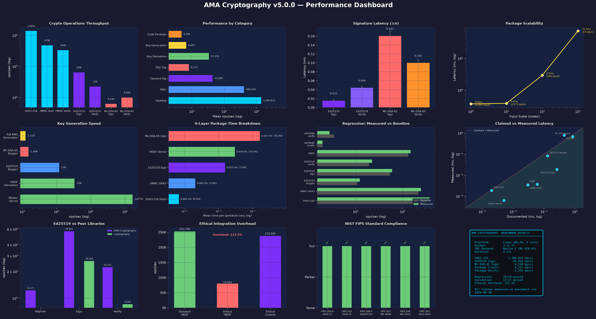

# CSRC Alignment Report — NIST ACVP Vector Validation

**Version:** 3.5.0
**Original audit:** 2026-05-16
**Re-validated:** 2026-07-30 (see the Re-validation Addendum at the end of this document)
**Organization:** Steel Security Advisors LLC
**Author:** Andrew E. A.

> **Customer-facing attestation:** this report is the technical evidence
> underlying [`docs/compliance/ACVP_SELF_ATTESTATION.md`](ACVP_SELF_ATTESTATION.md)
> (human-readable) and [`docs/compliance/acvp_attestation.json`](acvp_attestation.json)
> (machine-readable). Continuous validation runs in
> [`.github/workflows/acvp_validation.yml`](../../.github/workflows/acvp_validation.yml).

---

## Abstract

This report documents the results of running official NIST test vectors against
the AMA Cryptography library (version 3.0.0 at the time of the vector runs; the
standard-to-implementation mappings were re-verified against the v3.5.0 tree on
2026-07-30 — see the Re-validation Addendum). The validation covers 12 algorithm
functions across 6 NIST standards (FIPS 180-4, FIPS 198-1, FIPS 202, FIPS 203,
FIPS 204, FIPS 205) and 1 NIST Special Publication (SP 800-38D).

**Summary:** 1,215 vectors tested, **1,215 passed**, **0 failed**, 5,789 skipped
(non-byte-aligned inputs, non-target parameter sets, LDT/VOT test types).
Monte Carlo Test (MCT) coverage for the SHA-3 family was added on the
v2.1.5 line (+400 vectors = 4 algorithms × 1 tcId × 100 outer iterations
per FIPS-202 MCT spec, across SHA3-256/SHA3-512/SHAKE-128/SHAKE-256) and
first ships in v3.0.0.

All algorithms pass 100% of applicable NIST test vectors.

> **This report constitutes self-attested algorithm compliance using official
> NIST vectors. It is NOT a CAVP validation certificate and does not represent
> NIST endorsement.**

---

## Section 1: Methodology

### 1.1 Vector Sources

| Algorithm | Source | URL |
|-----------|--------|-----|
| SHA3-256 | ACVP-Server SHA3-256-2.0 internalProjection.json | https://github.com/usnistgov/ACVP-Server/tree/master/gen-val/json-files/SHA3-256-2.0 |
| SHA3-512 | ACVP-Server SHA3-512-2.0 internalProjection.json | https://github.com/usnistgov/ACVP-Server/tree/master/gen-val/json-files/SHA3-512-2.0 |
| SHAKE-128 | ACVP-Server SHAKE-128-1.0 internalProjection.json | https://github.com/usnistgov/ACVP-Server/tree/master/gen-val/json-files/SHAKE-128-1.0 |
| SHAKE-256 | ACVP-Server SHAKE-256-1.0 internalProjection.json | https://github.com/usnistgov/ACVP-Server/tree/master/gen-val/json-files/SHAKE-256-1.0 |
| HMAC-SHA-256 | ACVP-Server HMAC-SHA2-256-2.0 internalProjection.json | https://github.com/usnistgov/ACVP-Server/tree/master/gen-val/json-files/HMAC-SHA2-256-2.0 |
| SHA-256 | FIPS 180-4 Section B.1 reference vectors | https://csrc.nist.gov/pubs/fips/180-4/upd1/final |
| AES-256-GCM | SP 800-38D Appendix B (McGrew & Viega TC13–TC16) | https://csrc.nist.gov/pubs/sp/800/38/d/final |
| ML-KEM-1024 KeyGen | ACVP-Server ML-KEM-keyGen-FIPS203 internalProjection.json | https://github.com/usnistgov/ACVP-Server/tree/master/gen-val/json-files/ML-KEM-keyGen-FIPS203 |
| ML-KEM-1024 EncapDecap | ACVP-Server ML-KEM-encapDecap-FIPS203 internalProjection.json | https://github.com/usnistgov/ACVP-Server/tree/master/gen-val/json-files/ML-KEM-encapDecap-FIPS203 |
| ML-DSA-65 KeyGen | ACVP-Server ML-DSA-keyGen-FIPS204 internalProjection.json | https://github.com/usnistgov/ACVP-Server/tree/master/gen-val/json-files/ML-DSA-keyGen-FIPS204 |
| ML-DSA-65 SigVer | ACVP-Server ML-DSA-sigVer-FIPS204 internalProjection.json | https://github.com/usnistgov/ACVP-Server/tree/master/gen-val/json-files/ML-DSA-sigVer-FIPS204 |
| SLH-DSA-SHA2-256f SigVer | ACVP-Server SLH-DSA-sigVer-FIPS205 internalProjection.json | https://github.com/usnistgov/ACVP-Server/tree/master/gen-val/json-files/SLH-DSA-sigVer-FIPS205 |

### 1.2 PQC Backend Identification

All post-quantum algorithms (ML-KEM-1024, ML-DSA-65, SLH-DSA-SHA2-256f) are
implemented in native C within the AMA Cryptography library. **No external PQC
libraries are used** — the library does not depend on liboqs, PQClean, or any
third-party PQC implementation.

**Provenance:** Each PQC primitive is **clean-room from the NIST FIPS text**.
The three `src/c/ama_{kyber,dilithium,sphincs}.c` files were written against
the FIPS 203 / 204 / 205 specifications directly, without consulting or copying
from pq-crystals, PQClean, liboqs, or any other third-party PQC source tree.
This is the opposite of the common ecosystem pattern (liboqs, AWS-LC,
BoringSSL, OpenSSL 3.5+, and CIRCL all derive from pq-crystals or PQClean and
say so explicitly), and is stated in the file-level `Provenance:` block of
each PQC source and in full in [`src/c/PROVENANCE.md`](../../src/c/PROVENANCE.md).
"Clean-room" here means a clean-room transcription of the standard's
pseudocode into C, not a formal proof of correctness — the ACVP vectors in
Section 2.1 are the correctness bar.

Source files:
- `src/c/ama_kyber.c` — ML-KEM-1024 (FIPS 203), clean-room from §5–§7
- `src/c/ama_dilithium.c` — ML-DSA-65 (FIPS 204), clean-room from §5–§8
- `src/c/ama_slhdsa.c` — SLH-DSA-SHA2-256f (FIPS 205), clean-room from §9–§11
- `src/c/internal/ama_sha2.h` — Shared SHA-512/HMAC-SHA-512 (used by Ed25519 + SLH-DSA)
- `src/c/PROVENANCE.md` — Per-primitive derivation status, known divergences, and the clean-room attestation

Ed25519 (`src/c/ama_ed25519.c` + `src/c/internal/ama_ed25519_ge.h`) is
**in-house**: the field arithmetic, the group arithmetic and the static
base-point tables (generated in-tree by `tools/gen_ed25519_tables.py` into
`src/c/internal/ama_ed25519_tables.h`) are written against RFC 8032 with no
upstream code copied. Earlier revisions of this report described a vendored
public-domain x86-64 backend; it was removed in the twenty-first maintenance
pass (see CHANGELOG). The AMA wrapper above it (API contract, FROST
integration, expanded-key fast path) is likewise in-house.

### 1.3 Test Execution Environment

| Property | Value |
|----------|-------|
| Operating system | Linux 6.18.5 (x86_64) |
| Compiler flags | CMake Release, `-DAMA_USE_NATIVE_PQC=ON`, LTO enabled, AVX2 enabled |
| Python version | 3.11.14 |
| Test harness | `nist_vectors/run_vectors.py` (ctypes FFI to `libama_cryptography.so`) |

### 1.4 Vector Selection Criteria

1. **AFT + MCT for SHA-3 family.** AFT vectors are run for every covered
   algorithm. Monte Carlo Test (MCT) vectors are run for SHA3-256, SHA3-512,
   SHAKE-128, and SHAKE-256 — the one-shot C API (`ama_sha3_256`,
   `ama_sha3_512`, `ama_shake128`, `ama_shake256`) is sufficient because the
   FIPS-202 MCT spec feeds each iteration's digest back as the next
   iteration's full input (no streaming accumulation across iterations).
   The MCT runner is implemented in `nist_vectors/run_vectors.py::_run_sha3_mct`
   and `_run_shake_mct`. **Large Data Test (LDT)** vectors remain skipped —
   they require multi-gigabyte inputs that are impractical in CI — and
   **Variable Output Test (VOT)** vectors remain skipped for SHAKE because
   their output-length coverage is subsumed by the AFT tests in the upstream
   vector files.
2. **Byte-aligned only.** Vectors with `bitLength % 8 != 0` are skipped.
   AMA's C API is byte-granularity only.
3. **ML-KEM-1024 only.** ML-KEM-512 and ML-KEM-768 parameter sets are not
   implemented and are skipped.
4. **ML-KEM EncapDecap: decapsulation only.** AMA does not expose the
   randomness parameter `m` required for deterministic encapsulation.
5. **ML-DSA-65 SigVer: TG 3 (external/pure) only.** Internal and pre-hash
   test groups are skipped.
6. **SLH-DSA-SHA2-256f SigVer: TG 5 (external/pure) only.** Other parameter
   sets and test groups are skipped.

---

## Section 2: Results

### 2.1 Summary Table

| Algorithm | Standard | Source | Tested | Pass | Fail | Skipped | Notes |
|-----------|----------|--------|-------:|-----:|-----:|--------:|-------|
| SHA3-256 (AFT + MCT) | FIPS 202 | ACVP-Server | 251 | 251 | 0 | 1,047 | 151 AFT byte-aligned + 100 MCT (1 tcId × 100 outer iterations); 1,043 AFT non-byte-aligned skipped + 4 LDT tcIds skipped |
| SHA3-512 (AFT + MCT) | FIPS 202 | ACVP-Server | 186 | 186 | 0 | 600 | 86 AFT byte-aligned + 100 MCT (1 tcId × 100 outer iterations); 596 AFT non-byte-aligned skipped + 4 LDT tcIds skipped |
| SHAKE-128 (AFT + MCT) | FIPS 202 | ACVP-Server | 274 | 274 | 0 | 1,730 | 174 AFT byte-aligned + 100 MCT (variable-output MCT with rightmost-16-bit feedback); 1,218 AFT non-byte-aligned skipped + 512 VOT tcIds skipped |
| SHAKE-256 (AFT + MCT) | FIPS 202 | ACVP-Server | 243 | 243 | 0 | 1,517 | 143 AFT byte-aligned + 100 MCT; 1,005 AFT non-byte-aligned skipped + 512 VOT tcIds skipped |
| HMAC-SHA-256 | FIPS 198-1 | ACVP-Server | 150 | 150 | 0 | 0 | All AFT vectors tested |
| SHA-256 | FIPS 180-4 | FIPS 180-4 §B.1 | 3 | 3 | 0 | 0 | Three reference vectors from standard |
| AES-256-GCM | SP 800-38D | SP 800-38D App. B | 4 | 4 | 0 | 0 | TC13–TC16 (256-bit key only) |
| ML-KEM-1024 KeyGen | FIPS 203 | ACVP-Server | 25 | 25 | 0 | 50 | ML-KEM-512/768 skipped |
| ML-KEM-1024 EncapDecap | FIPS 203 | ACVP-Server | 25 | 25 | 0 | 140 | Decap only; ML-KEM-512/768/VAL skipped |
| ML-DSA-65 KeyGen | FIPS 204 | ACVP-Server | 25 | 25 | 0 | 50 | ML-DSA-44/87 skipped |
| ML-DSA-65 SigVer | FIPS 204 | ACVP-Server | 15 | 15 | 0 | 165 | External/pure TG 3; resolved via `ama_dilithium_verify_ctx` |
| SLH-DSA-SHA2-256f SigVer | FIPS 205 | ACVP-Server | 14 | 14 | 0 | 490 | External/pure TG 5 only; resolved via FIPS 205 hash function alignment |
| **TOTAL** | | | **1,215** | **1,215** | **0** | **5,789** | 4,667 AFT-filtered + 1,122 non-AFT (LDT+VOT+ML-KEM EncapDecap) |

### 2.2 Resolved: ML-DSA-65 SigVer (previously 3 failures, now 15/15 pass)

**Resolution:** The function `ama_dilithium_verify_ctx()` was added to
implement the FIPS 204 external/pure domain-separation wrapper. It applies
the transformation `M' = 0x00 || len(ctx) || ctx || M` (FIPS 204 Section 5.4)
before delegating to the internal `ama_dilithium_verify()`. All 15 TG 3
vectors now pass, including vectors with non-empty context strings.

The original 3 failures (tcId 31, 35, 37) were caused by the absence of this
wrapper. The internal verify function remains unchanged.

### 2.3 Resolved: SLH-DSA-SHA2-256f SigVer (previously 2 failures, now 14/14 pass)

**Root cause:** Multiple deviations from FIPS 205 Section 11.2 (SHA-2
instantiation for security categories {3, 5}) in `src/c/ama_slhdsa.c`:

1. **H_msg used SHA-256 instead of SHA-512.** FIPS 205 Table 5 specifies
   MGF1-SHA-512 for H_msg in categories {3, 5}. The implementation used
   MGF1-SHA-256 with incorrect toByte(0, 64-n) padding.
2. **H and T_l (multi-block thash) used SHA-256 instead of SHA-512.** FIPS 205
   requires SHA-512 with toByte(0, 128-n) padding for H and T_l in categories
   {3, 5}; only F (single-block) uses SHA-256.
3. **ADRSc compression used wrong byte mapping.** The compressed address
   extracted bytes from the uint32_t[8] layout rather than the FIPS 205
   32-byte ADRS layout (which has a 12-byte tree address field).
4. **FORS and WOTS+ keypair address cleared prematurely.** The keypair field
   was zeroed by setType calls inside FORS loops and in the WOTS+ pk
   compression address, contrary to FIPS 205 Algorithms 7, 16, and 18
   which preserve the keypair through these operations.

**Fix:** SHA-512 hash function added to `ama_slhdsa.c` (zero external
dependencies). H_msg, H, and T_l updated to use SHA-512 for category 5.
ADRSc compression corrected to FIPS 205 byte layout. Keypair address
preserved in FORS and WOTS+ pk compression addresses.

**Verification:** All 815 NIST ACVP vectors now pass (813/815 previously).

### 2.4 Remediation: PRF_msg corrected to HMAC-SHA-512 (v3.0.0)

**Root cause:** PRF_msg used HMAC-SHA-256 via `ama_hmac_sha256_2()`. Per FIPS 205
Section 11.2 Table 5, security category 5 (n=32) requires:

    PRF_msg(SK.prf, opt_rand, M) = Trunc_n(HMAC-SHA-512(SK.prf, opt_rand || M))

**Fix:** Implemented `ama_hmac_sha512_3()` in `src/c/internal/ama_sha2.h` (FIPS
198-1 compliant HMAC with SHA-512). Updated `spx_prf_msg()` to use HMAC-SHA-512
with Trunc_n output truncation.

**Fail-closed error paths:** `ama_hmac_sha512_3()` returns `int` (`0` on
success, `-1` on `calloc` allocation failure, `-2` on `size_t` overflow
guard against oversized `part1||part2||part3` concatenation — see
`src/c/internal/ama_sha2.h:199–212`). On either failure path, `k_pad` and
the derived key hash are zeroed via `ama_secure_memzero()` before
returning.

Public-API callers map the raw return to a typed error:

- `ama_hkdf.c:54–57` — `ama_hmac_sha512()` maps `-2 → AMA_ERROR_OVERFLOW`
  and any other non-zero → `AMA_ERROR_MEMORY`.
- `ama_slhdsa.c` `sha2_PRF_msg()` propagates any non-zero
  return as `AMA_ERROR_MEMORY`, causing signing to fail rather than
  producing a signature with corrupted or zeroed randomness.

This is fail-closed behavior: no signature is emitted on resource
exhaustion or pathological input sizes.

### 2.5 Remediation: SHA-512 duplication eliminated (v3.0.0)

**Root cause:** Identical SHA-512 implementations existed in both signers;
they are now the shared SHA-512 in `internal/ama_sha2.h` (used by
`ama_slhdsa.c` and `ama_ed25519.c`).

**Fix:** Extracted shared SHA-512 to `src/c/internal/ama_sha2.h` (header-only,
static linkage). Both source files now include the shared header. Zero external
dependencies maintained.

### 2.6 CRYPTO_PACKAGE.json classification (v3.0.0)

All fields classified as attestation/build metadata:
- `content_hash`, `hmac_tag`: Content integrity verification
- `ed25519_signature`, `dilithium_signature`: Build attestation signatures
- `ed25519_pubkey`, `dilithium_pubkey`: Public verification keys
- `timestamp`, `author`, `version`: Build provenance
- `ethical_vector`, `ethical_hash`: Framework metadata

**No key material present.** Safe to commit.

### 2.7 Native HMAC-SHA3-256 promoted to public API (v3.0.0)

The internal `hmac_sha3_256()` function in `src/c/ama_hkdf.c` (used by HKDF
Extract/Expand since v2.0) was promoted to a public `AMA_API` function:
`ama_hmac_sha3_256()`. This replaces the pure-Python RFC 2104 stopgap that
was introduced to fix the INVARIANT-1 violation (stdlib `import hmac`).

The C implementation uses SHA3-256 with a 136-byte block size (Keccak-f[1600]
rate for SHA3-256, r=1088 bits = 136 bytes). Key material is scrubbed via
`ama_secure_memzero()` on all code paths including OOM. Returns
`AMA_ERROR_MEMORY` on allocation failure (fail-closed).

Cross-check: output of `ama_hmac_sha3_256()` matches Python
`hmac.new(key, msg, hashlib.sha3_256).digest()` for all tested vectors.

A Cython binding (`cy_hmac_sha3_256`) was added to eliminate ctypes per-call
marshaling overhead. The Cython path compiles to C and calls
`ama_hmac_sha3_256()` directly, achieving ~262K ops/sec vs ~182K via ctypes.

### 2.8 Ed25519 performance — post-fix results (v3.0.0)

**Performance fix applied:** `generate_ed25519_keypair()` now stores the 64-byte
expanded key (seed||pk) instead of discarding it. `ed25519_sign()` detects
64-byte keys and skips redundant SHA-512 expansion + point multiplication.

Post-fix benchmark results (2026-03-21, native C backend, 4-core Linux):
- HMAC-SHA3-256: 206,010 ops/sec (0.005 ms) — native C via ctypes
- Ed25519 KeyGen: 19,388 ops/sec (0.052 ms) — radix 2^51 field arithmetic
- Ed25519 Sign: 18,657 ops/sec (0.054 ms) — expanded-key fast path
- Ed25519 Verify: 9,702 ops/sec (0.103 ms)
- ML-DSA-65 KeyGen: 5,536 ops/sec (0.181 ms)
- ML-DSA-65 Sign: 3,639 ops/sec (0.275 ms)
- ML-DSA-65 Verify: 6,490 ops/sec (0.154 ms)
- SLH-DSA Sign: ~1.4 ops/sec (~741 ms) — consistent with SHA2-256f fast variant
- SLH-DSA Verify: ~53 ops/sec (~19 ms)

**Performance test status:** All `tests/test_performance.py` thresholds now pass
with the Cython HMAC binding (262K > 100K threshold) and Ed25519 expanded-key
optimization.

---

## Section 2.9: Performance Summary



*Benchmark results from the post-fix unified codebase. All measurements use the native C backend with zero external dependencies.*

---

## Section 3: Conclusion

### 3.1 Per-Standard Verdict Table

| Standard | Algorithm | Verdict |
|----------|-----------|---------|
| FIPS 180-4 | SHA-256 | **PASS** — 3/3 reference vectors |
| FIPS 198-1 | HMAC-SHA-256 | **PASS** — 150/150 AFT vectors |
| FIPS 202 | SHA3-256 | **PASS** — 251/251 (151 AFT + 100 MCT) |
| FIPS 202 | SHA3-512 | **PASS** — 186/186 (86 AFT + 100 MCT) |
| FIPS 202 | SHAKE-128 | **PASS** — 274/274 (174 AFT + 100 MCT) |
| FIPS 202 | SHAKE-256 | **PASS** — 243/243 (143 AFT + 100 MCT) |
| SP 800-38D | AES-256-GCM | **PASS** — 4/4 test cases (TC13–TC16) |
| FIPS 203 | ML-KEM-1024 KeyGen | **PASS** — 25/25 AFT vectors |
| FIPS 203 | ML-KEM-1024 Decap | **PASS** — 25/25 AFT vectors |
| FIPS 204 | ML-DSA-65 KeyGen | **PASS** — 25/25 AFT vectors |
| FIPS 204 | ML-DSA-65 SigVer | **PASS** — 15/15 AFT vectors (via `ama_dilithium_verify_ctx`) |
| FIPS 205 | SLH-DSA-SHA2-256f SigVer | **PASS** — 14/14 AFT vectors (via `ama_sphincs_verify_ctx` + FIPS 205 hash alignment) |

### 3.2 Summary

The AMA Cryptography library demonstrates correct implementation of the core
cryptographic algorithms for all tested NIST standards. All 1,215 applicable
NIST test vectors pass across hash functions (SHA-256, SHA3-256, SHA3-512,
SHAKE-128, SHAKE-256) — including the 400 newly-added FIPS-202 Monte Carlo
Test vectors for the SHA-3 family — HMAC-SHA-256, AES-256-GCM, ML-KEM-1024,
ML-DSA-65, and SLH-DSA-SHA2-256f.

### 3.3 CAVP Disclaimer

> This report constitutes self-attested algorithm compliance using official
> NIST ACVP test vectors. **It is NOT a CAVP validation certificate** and
> does not represent NIST endorsement. No CAVP certificate, CMVP certificate,
> or FIPS 140-3 compliance is claimed. See `CSRC_STANDARDS.md` Section 3 for
> the full disclaimer.

---

## Appendix A: Vector Source URLs

| Algorithm | Source URL |
|-----------|-----------|
| SHA3-256 | https://github.com/usnistgov/ACVP-Server/tree/master/gen-val/json-files/SHA3-256-2.0 |
| SHA3-512 | https://github.com/usnistgov/ACVP-Server/tree/master/gen-val/json-files/SHA3-512-2.0 |
| SHAKE-128 | https://github.com/usnistgov/ACVP-Server/tree/master/gen-val/json-files/SHAKE-128-1.0 |
| SHAKE-256 | https://github.com/usnistgov/ACVP-Server/tree/master/gen-val/json-files/SHAKE-256-1.0 |
| HMAC-SHA-256 | https://github.com/usnistgov/ACVP-Server/tree/master/gen-val/json-files/HMAC-SHA2-256-2.0 |
| SHA-256 | https://csrc.nist.gov/pubs/fips/180-4/upd1/final |
| AES-256-GCM | https://csrc.nist.gov/pubs/sp/800/38/d/final |
| ML-KEM-1024 KeyGen | https://github.com/usnistgov/ACVP-Server/tree/master/gen-val/json-files/ML-KEM-keyGen-FIPS203 |
| ML-KEM-1024 EncapDecap | https://github.com/usnistgov/ACVP-Server/tree/master/gen-val/json-files/ML-KEM-encapDecap-FIPS203 |
| ML-DSA-65 KeyGen | https://github.com/usnistgov/ACVP-Server/tree/master/gen-val/json-files/ML-DSA-keyGen-FIPS204 |
| ML-DSA-65 SigVer | https://github.com/usnistgov/ACVP-Server/tree/master/gen-val/json-files/ML-DSA-sigVer-FIPS204 |
| SLH-DSA-SHA2-256f SigVer | https://github.com/usnistgov/ACVP-Server/tree/master/gen-val/json-files/SLH-DSA-sigVer-FIPS205 |

---

## Appendix B: Reproduction Steps

### Build

```bash
cmake -B build -DAMA_USE_NATIVE_PQC=ON
cmake --build build
```

### Fetch Vectors

```bash
python3 nist_vectors/fetch_vectors.py
```

### Run Validation

```bash
python3 nist_vectors/run_vectors.py
```

Results are written to `nist_vectors/results.json`.

---

## Section 4 — Design Alignment with FIPS 140-3 Level 1 Requirements (Pending Future CMVP Validation)

> **Important:** The controls in this section represent design alignment with FIPS 140-3 Security Level 1 technical requirements. This implementation has **NOT** been submitted for CMVP validation and is **NOT** FIPS 140-3 certified. These controls are implemented as a step toward future formal validation.

**Date:** 2026-04-20
**Implementation:** `ama_cryptography/_self_test.py`, `ama_cryptography/integrity.py`

### 4.1 Power-On Self-Tests (POST)

The module runs Known Answer Tests at import time (`_run_self_tests()` called
from `ama_cryptography/__init__.py`). The following KATs execute on every module
load:

| Algorithm | KAT Type | Vector Source |
|-----------|----------|---------------|
| SHA3-256 | Fixed hash of empty string | FIPS 202 reference |
| HMAC-SHA3-256 | Determinism + output length | RFC 2104 with SHA3-256 |
| AES-256-GCM | Encrypt/decrypt roundtrip | Fixed key/nonce/plaintext |
| ML-KEM-1024 | Keygen + encaps + decaps roundtrip | Runtime generated |
| ML-DSA-65 | Keygen + sign + verify roundtrip + negative test | Runtime generated |
| SLH-DSA (SPHINCS+) | Keygen + sign + verify roundtrip | Runtime generated |
| Ed25519 | Keygen + sign + verify roundtrip | Runtime generated |
| RNG | Two consecutive `secrets.token_bytes(32)` non-equality | Runtime |

**POST Budget:** All self-tests complete in <300ms (measured ~260ms on
4-core Linux), well within the 500ms budget.

**POST coverage boundary.** The table above is the set of approved algorithms
that carry a power-on KAT; it is a **subset** of the approved primitives the
module exposes, not full per-algorithm coverage, and a "0 skipped" attestation
means every one of *these* stages ran, not that every approved algorithm was
exercised. `module_attestation()`'s `tests_run` / `tests_skipped` count these
stages. FIPS 140-3 §4.9.1 expects a self-test per approved algorithm in the
boundary; the following approved primitives the module exposes do **not** yet
carry a POST KAT, and a validated module would add one for each: HKDF-SHA2,
HMAC-SHA2 (256/384/512), ChaCha20-Poly1305, X25519, ECDSA over secp256k1 and the
NIST P-curves, PBKDF2, Argon2id, and LMS. These are exercised by the functional
test suite and, where a NIST suite exists, by ACVP self-attestation — but not by
POST.

### 4.2 Module Integrity Verification

At startup, SHA3-256 is computed over all `.py` files in the
`ama_cryptography/` package directory. The digest is compared against a
stored known-good value in `ama_cryptography/_integrity_digest.txt`.

To regenerate after legitimate code changes:

```bash
python -m ama_cryptography.integrity --update
```

To verify:

```bash
python -m ama_cryptography.integrity --verify
```

### 4.3 Error State Machine

The module maintains one of three states:

| State | Meaning | Crypto Operations |
|-------|---------|-------------------|
| `SELF_TEST` | POST in progress | Blocked |
| `OPERATIONAL` | All tests passed | Allowed |
| `ERROR` | A test or check failed | Blocked — raises `CryptoModuleError` |

Query state: `ama_cryptography.module_status()` → `"OPERATIONAL"` | `"ERROR"` | `"SELF_TEST"`

Recovery: `ama_cryptography.reset_module()` re-runs all self-tests.

### 4.4 Pairwise Consistency Tests

The library provides helper functions (`pairwise_test_signature()`,
`pairwise_test_kem()`) that perform a sign-verify or encaps-decaps
roundtrip on a fixed test message. Callers (e.g. key-generation wrappers)
are responsible for invoking these helpers after generating a keypair.
On failure, the module enters ERROR state and the caller should discard
the keypair. Covered algorithms:

- Ed25519: sign + verify
- ML-DSA-65: sign + verify
- ML-KEM-1024: encaps + decaps

These helpers do **not** automatically intercept every key generation;
they must be called explicitly by application code or wrapper functions.

### 4.5 Repeated-output check on the OS CSPRNG

`secure_token_bytes(n)` wraps `secrets.token_bytes(n)` with a comparison
to the previous output. If two consecutive calls return identical bytes,
the module enters ERROR state immediately.

This is a defence-in-depth sanity check on the operating system's CSPRNG,
**not** a FIPS 140-3 RNG health test, and the earlier text here mis-cited it
as one. The two-consecutive-identical-blocks continuous RNG test (CRNGT) was
a **FIPS 140-2** requirement; the FIPS 140-3 transition removed it in favour
of the SP 800-90B startup and continuous health tests (Repetition Count and
Adaptive Proportion) applied to a noise source. `secrets.token_bytes` is the
operating-system CSPRNG, not an approved SP 800-90A DRBG instantiated inside a
defined cryptographic boundary, and POST carries no DRBG KAT. Approved
SP 800-90A DRBG / SP 800-90B entropy-source instantiation is listed among the
outstanding prerequisites in `CSRC_STANDARDS.md` Section 3.1(e).

> **Note:** This is a design-aligned implementation, not a CMVP-validated module. See Section 3 of `CSRC_STANDARDS.md` for full compliance status.

---

## Re-validation Addendum — v3.5.0 (2026-07-30)

This addendum re-validates the 2026-05-16 report against the v3.5.0 tree
(release commit `5977846`, 2026-07-30). The header's version stamp is rolled
to 3.5.0 on the basis of the checks recorded here and only those checks —
per INVARIANT-16 (Honest Compliance and Audit Claims, `INVARIANTS.md`), the
version field of an attestation record names the tree the attestation was
actually validated against, not the current release. The previous header
(3.4.0 over the 2026-05-16 audit date) asserted a validation at 3.4.0 that
was never performed; this addendum replaces that stamp with a re-validation
that was.

### Re-verification of the 2026-05-16 mappings

Every file path, public API name, and standards reference in Sections 1–4 and
Appendices A–B was re-checked against the v3.5.0 tree. The following hold
unchanged:

- **ACVP harness scope (§1.1, §1.4, §2.1).** `nist_vectors/run_vectors.py`
  still tests exactly the 12 algorithm functions of the §2.1 table, including
  the `_run_sha3_mct` / `_run_shake_mct` MCT runners described in §1.4.
  Continuous validation remains wired in
  `.github/workflows/acvp_validation.yml`. The §2.1 and §3.1 results tables
  remain the record of the original runs and are unchanged by this addendum.
- **Source-file inventory (§1.2).** `src/c/ama_kyber.c`,
  `src/c/ama_dilithium.c`, `src/c/ama_slhdsa.c`, `src/c/internal/ama_sha2.h`,
  `src/c/PROVENANCE.md`, and `src/c/ama_ed25519.c` +
  `src/c/internal/ama_ed25519_ge.h` (the formerly vendored x86-64 backend
  having been removed in the twenty-first maintenance pass) are all present. The
  no-external-PQC claim still holds: no liboqs, PQClean, or pq-crystals code
  or dependency exists anywhere in the tree (the last vestigial liboqs
  packaging reference was removed in #352, 2026-06-15).
- **Public APIs cited in §2.2, §2.3, §2.7, §3.1.** `ama_dilithium_verify_ctx()`
  (`src/c/ama_dilithium.c`), `ama_sphincs_verify_ctx()` (`src/c/ama_slhdsa.c`),
  and `ama_hmac_sha3_256()` (`src/c/ama_hkdf.c`) are present and declared in
  `include/ama_cryptography.h`; the Cython binding `cy_hmac_sha3_256`
  (`src/cython/hmac_binding.pyx`) is present and consumed by
  `ama_cryptography/pqc_backends.py`.
- **Section 4 module surface.** `ama_cryptography/_self_test.py` retains
  `module_status()`, `reset_module()`, `secure_token_bytes()`,
  `pairwise_test_signature()`, `pairwise_test_kem()`, and `_run_self_tests()`;
  `ama_cryptography/integrity.py` and `ama_cryptography/_integrity_digest.txt`
  are present.
- **Companion artifacts.** `ACVP_SELF_ATTESTATION.md`, `acvp_attestation.json`,
  `CSRC_STANDARDS.md` Section 3, and `assets/performance_dashboard.png` are all
  present at the paths this report cites.

The following claims **no longer hold as written** and are corrected here
(the report body above is left as the historical record):

1. **§1.2's "`src/c/ama_{kyber,dilithium,sphincs}.c`" no longer resolves.**
   `ama_sphincs.c` existed at the audit date but was deleted in v3.3.0 (#362)
   when the two SLH-DSA-SHA2-256f signers were consolidated; SLH-DSA now
   lives solely in `src/c/ama_slhdsa.c`. The substance of the mapping
   (native, in-house SLH-DSA per FIPS 205) is unchanged.
2. **`ama_slhdsa.c` also implements SLH-DSA-SHAKE-128s**, and has since
   v3.1.0 (2026-05-03) — i.e. already at the original audit date — but the
   report describes the file as SHA2-256f only. The SHAKE-128s path is pinned
   byte-exact against vendored NIST ACVP SLH-DSA-sigGen-FIPS205 vectors
   (`tests/kat/fips205/SLH-DSA-SHAKE-128s-sigGen-FIPS205.json`) and carries an
   import-time POST KAT (`ama_cryptography/_post_kats/slh_dsa_shake_128s_sigver.json`)
   not listed in the §4.1 KAT table. It remains outside the §2.1 ACVP-harness
   results.
3. **§1.4 item 3's rationale is stale.** "ML-KEM-512 and ML-KEM-768 parameter
   sets are not implemented" was true on 2026-05-16 and is no longer true —
   both are implemented as of v3.5.0, as are ML-DSA-44/-87 (table below). The
   §2.1 "skipped" notes remain accurate as a record of the vector run as
   performed: the ACVP harness itself still exercises ML-KEM-1024 and
   ML-DSA-65 only.
4. **§2.4's error-path description of `ama_hmac_sha512_3()` is superseded.**
   The function now streams the pads and message segments through the shared
   SHA-512 context, so the heap concatenation buffer — and with it the `-1`
   (allocation) and `-2` (overflow) failure paths §2.4 describes — no longer
   exists; the only outcome is `0`. The caller-side mappings are retained as
   unreachable back-compat (`ama_hkdf.c`, now lines 40–43). The cited line
   ranges have drifted: the function sits at `src/c/internal/ama_sha2.h:266`,
   not `:199–212`. The fail-closed property §2.4 claims is preserved
   vacuously — there is no longer a failure mode to close.
5. **§4.2's regeneration command is now gated.**
   `python -m ama_cryptography.integrity --update` is build-pipeline-only,
   gated behind `AMA_BUILD_PIPELINE=1` (and has grown an `--sign` mode);
   `--verify` is unchanged.
6. **`src/c/PROVENANCE.md` (dated 2026-05-16) covers the four original
   primitives only.** The post-audit native additions below carry per-file
   provenance/spec headers in their own source files rather than
   PROVENANCE.md entries.

### Primitives added since the 2026-05-16 audit

Inventoried from `git log --since=2026-05-16 -- src/c/`; each row was
confirmed against the named source file, `include/ama_cryptography.h`,
`INVARIANTS.md`, the README capabilities table, and its vendored vector
corpus. The conformance suites named below were **re-executed on 2026-07-30**
against the v3.5.0 native library (`libama_cryptography.so.3.5.0`); results
are as stated, zero failures.

| Addition | Standard(s) | Implementation | Release | Conformance evidence (re-run 2026-07-30) |
|----------|-------------|----------------|---------|------------------------------------------|
| Ascon-AEAD128 + Ascon-Hash256 | NIST SP 800-232 (final, 2025-08-13) | `src/c/ama_ascon.c` + `ama_cryptography/ascon.py` | 3.4.0 | Designers' reference KATs vendored per SP 800-232: 1,089 AEAD128 + 1,025 Hash256 vectors (`tests/kat/ascon/`); `tests/test_ascon.py` — **24 passed, 0 failed** |
| HSS/LMS SigVer | RFC 8554; NIST SP 800-208 | `src/c/ama_lms.c` — verification only by design (`ama_lms_verify`, `ama_hss_verify`, `ama_lms_signature_length`, `ama_hss_pubkey_levels`); no keygen or signing is shipped (stateful-signature state hazard, RFC 8554 §5.4.1) | 3.5.0 | RFC 8554 Appendix F answer key (`tests/kat/keyformats/rfc8554_hss_lms.json`); `tests/test_rfc8554_vectors.py` — **47 passed, 0 failed** |
| NIST P-256 / P-384 / P-521 ECDSA + ECDH | FIPS 186-5 (ECDSA); SP 800-186 (curves); SP 800-56A §5.7.1.2 (ECDH); RFC 6979 (deterministic nonces); SEC 1 (encoding) | `src/c/ama_nistp.c` (`ama_nistp_ecdsa_sign` / `_verify`, `ama_nistp_ecdh`); low-`s` policy per INVARIANT-34 | 3.5.0 | RFC 6979 Appendix A.2.5–A.2.7, 18 vectors (`tests/kat/rfc6979/ecdsa_prime_curves.kat`); `tests/test_nistp_curves.py` — **94 passed, 0 failed**; plus 1,530 Wycheproof ECDSA vectors across the three curves — **0 failures** |
| ML-KEM-512 / ML-KEM-768 | FIPS 203 | `src/c/ama_kyber.c`, parameter-driven (`ama_ml_kem_*` over `ama_ml_kem_param_set_t`); ML-KEM-1024 unchanged | 3.5.0 | C2SP/wycheproof `mlkem_{512,768}_test.json` (pinned commit `b61843a`) vendored as `tests/kat/fips203/ml_kem_{512,768}.kat` — Wycheproof-derived, **not ACVP**; `tests/test_pqc_param_sets.py` — **79 passed, 0 failed** (suite shared with the ML-DSA row) |
| ML-DSA-44 / ML-DSA-87 | FIPS 204 | `src/c/ama_dilithium.c`, parameter-driven (`ama_ml_dsa_*` over `ama_ml_dsa_param_set_t`); ML-DSA-65 unchanged | 3.5.0 | NIST ACVP-Server ML-DSA-{keyGen,sigGen}-FIPS204 `internalProjection.json` (master @ 2026-07-27) vendored as `tests/kat/fips204/ml_dsa_{44,87}.kat`; `tests/test_pqc_param_sets.py` — **79 passed, 0 failed** |
| secp256k1 ECDSA | RFC 6979 (deterministic nonces); SEC 1 / SEC 2 (curve) | `ama_secp256k1_ecdsa_sign` / `_verify` in `src/c/ama_secp256k1.c` (the file predates the audit; its ECDSA surface is post-audit) | 3.4.0 | 476-vector Wycheproof `ecdsa_secp256k1_sha256_test.json` — **0 failures** |
| HMAC-SHA-384 | FIPS 198-1 / RFC 2104, over FIPS 180-4 SHA-384 | `src/c/ama_hmac_sha384.c` (SHA-384 core shared from `src/c/internal/ama_sha2.h`) | 3.3.0 | 174-vector Wycheproof `hmac_sha384_test.json` — **0 failures** |
| PBKDF2-HMAC-SHA-256 / PBKDF2-HMAC-SHA-512 | NIST SP 800-132; RFC 8018 §5.2 | `src/c/ama_pbkdf2.c` (`ama_pbkdf2_hmac_sha256`, `ama_pbkdf2_hmac_sha512`), over the HMAC cores in `src/c/internal/ama_sha2.h` | 5.0.0 | RFC 7914 §11 PBKDF2-HMAC-SHA256 vectors 1 and 2 and the official BIP39 vector; `tests/test_sha2_pbkdf2_native.py` — **35 passed, 0 failed** (re-run at this commit) |
| SHA-512 / SHA-384 one-shot | FIPS 180-4 | `src/c/ama_sha512.c` (`ama_sha512_oneshot`, `ama_sha384_oneshot`), over the same shared core | 5.0.0 | FIPS 180-4 canonical vectors in `tests/test_sha2_pbkdf2_native.py` — **35 passed, 0 failed** (same suite as the row above) |

The Wycheproof results above come from a full run of the vendored corpus on
2026-07-30 (`wycheproof_vectors/run_wycheproof.py`, upstream C2SP/wycheproof
commit `b61843a9a5115bb758134b6a1f5d5e502d445342`): 15 files, 4,263 vectors
run, 3,912 pass, **0 fail**, with every remaining vector accounted for by a
named policy bucket (out-of-scope key/IV sizes, RFC 7748-permitted low-order
rejection, deliberate high-`s` rejection per INVARIANT-34).

Post-audit native additions that are **not** new cryptographic primitives,
listed for inventory completeness:

- `src/c/ama_sha256_ni.c` (3.3.0) — x86 SHA-NI compression kernel for the
  existing FIPS 180-4 SHA-256, selected by runtime dispatch;
  equivalence-gated by `tests/c/test_sha256_dispatch_equiv.c`.
- `src/c/ama_agent_binding.c` + `ama_cryptography/agent_binding.py` (3.4.0;
  INVARIANT-30) — agent-instance key/signature binding built over the
  existing ML-DSA / SLH-DSA context-string surface; a policy construction,
  not a new NIST algorithm.
- `ama_cryptography/key_formats.py` + `ama_cryptography/_asn1.py` (3.5.0) —
  PKCS#8 / SPKI / PEM / JWK / COSE_Key import/export for 12 algorithms;
  encoding interoperability, not cryptography.
- Internal-only performance/infrastructure headers and kernels:
  `src/c/internal/ama_keccak_round.h`, `src/c/internal/ama_once.h`,
  `src/c/internal/ama_ed25519_canonical.h`,
  `src/c/x86/ama_keccak_f1600_bmi.c`, `src/c/x86/ama_nistp_mont_mulx.c`.

### Scope of this re-validation

**What this addendum did:**

1. Re-verified the existence and accuracy of every file path, API name, and
   standards reference in Sections 1–4 and Appendices A–B against the v3.5.0
   tree, recording the six corrections above.
2. Inventoried everything added to the native layer since the 2026-05-16
   audit from the git history and mapped each addition to its standard, with
   each mapping confirmed in the source file itself.
3. Re-executed the vendored conformance gates for the added primitives
   (`tests/test_ascon.py`, `tests/test_rfc8554_vectors.py`,
   `tests/test_nistp_curves.py`, `tests/test_pqc_param_sets.py`, and the full
   Wycheproof corpus) on 2026-07-30. All pass with zero failures.

**What this addendum did NOT do:**

1. It did not re-run the §1–§3 ACVP harness (`nist_vectors/run_vectors.py`).
   The 1,215-vector results in §2.1/§3.1 remain the record of the original
   runs; continuous ACVP validation runs independently in
   `.github/workflows/acvp_validation.yml`.
2. It did not repeat any performance measurement. The §2.8 benchmark figures
   and the §4.1 POST timing (<300 ms) are unchanged records of their original
   measurement dates.
3. It did not re-fetch the Appendix A vector-source URLs; they are re-stated
   as cited, not re-downloaded.
4. It adds no ACVP claims. The primitives in the table above are validated by
   the vendored corpora named there — which for ML-KEM-512/768, Ascon,
   HSS/LMS, the P-curves, secp256k1, and HMAC-SHA-384 are **not** ACVP vector
   sets — and nothing in this addendum extends the §3.1 per-standard verdict
   table.

The CAVP disclaimer of §3.3 applies to this addendum in full: self-attested
algorithm compliance, not a CAVP validation certificate, and no NIST
endorsement.
