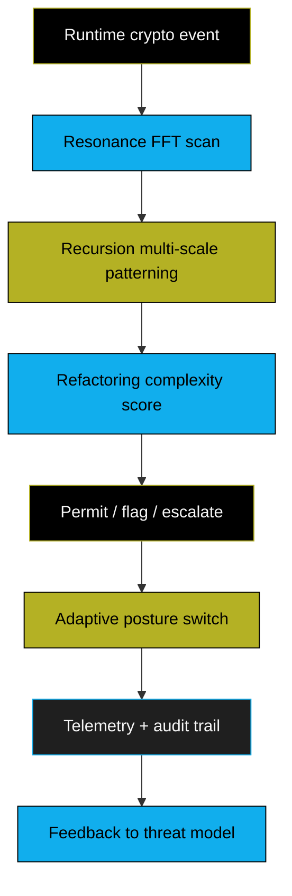

# AMA Cryptography Wiki

**Post-Quantum Security System — built for people, data, and networks**

> A hybrid classical and post-quantum cryptographic framework combining NIST-standardized algorithms with defense-in-depth architecture and runtime observability.

---

## How to use this wiki

- **Build & integrate:** [Installation](Installation) → [Quick Start](Quick-Start) → [API Reference](API-Reference)
- **Assure correctness:** [Security Model](Security-Model) → [Key Management](Key-Management) → [Adaptive Posture](Adaptive-Posture)
- **Operate & observe:** [Secure Memory](Secure-Memory) → [Hybrid Cryptography](Hybrid-Cryptography) → [Performance Benchmarks](Performance-Benchmarks)
- **Need a map?** Start with the system flow below; every node links to deeper pages.

---

## System Blueprint — cryptographic package lifecycle

**Why it matters:** Each stage is independently checkable. An attacker must subvert the assurance, cryptographic, and execution layers in sequence — a defense-in-depth chain instead of a single gate.

---

## Runtime Safety Loop — observability without guessing

---

## Navigation by intent

- **Build & Integrate:**
  - [Installation](Installation) — requirements, toolchains, wheels
  - [Quick Start](Quick-Start) — minimal create/verify package in 5 minutes
  - [API Reference](API-Reference) + [C API](C-API-Reference) — production calls, return codes
- **Assurance & Lifecycle:**
  - [Security Model](Security-Model) — threat coverage, residual risks, disclosure path
  - [Key Management](Key-Management) — hardened HD derivation, rotation, custody
  - [Adaptive Posture](Adaptive-Posture) — runtime policy toggles and allowed fallbacks
- **Operations & Performance:**
  - [Secure Memory](Secure-Memory) — zeroization, constant-time expectations
  - [Hybrid Cryptography](Hybrid-Cryptography) — binding combiners and KEM flow
  - [Performance Benchmarks](Performance-Benchmarks) — throughput, latency, scaling curves

---

## Build-with-confidence checklist

1. **Define the trust surface:** choose HSM/HKDF parameters; align with [Security Model](Security-Model).
2. **Assemble the pipeline:** wire the API call sequence from [Quick Start](Quick-Start) or [API Reference](API-Reference).
3. **Harden execution:** enable zeroization + monitoring from [Secure Memory](Secure-Memory) and [Adaptive Posture](Adaptive-Posture).
4. **Measure and observe:** run the 3R loop and record telemetry per [Performance Benchmarks](Performance-Benchmarks).

---

## Status snapshot

| Property | Value |
|----------|-------|
| Version | 5.0.0 |
| Algorithms | ML-DSA-44/-65/-87, ML-KEM-512/-768/-1024, SLH-DSA, HSS/LMS verify, Ed25519, FROST-Ed25519, ECDSA P-256/P-384/P-521 + secp256k1, X25519, AES-256-GCM, ChaCha20-Poly1305, Ascon-AEAD128, Ascon-Hash256, SHA-3/HKDF, Argon2id |
| Runtime safeguards | 3R monitoring, agent-instance binding (INVARIANT-30) |
| Platforms | Linux, macOS, Windows |
| Python | 3.10 – 3.14 |
| Audit | Community-tested · Not externally audited |
| License | Apache 2.0 |

> **Production guardrails:** Use a FIPS 140-2 Level 3+ HSM for master secrets, enforce constant-time verification, and perform independent cryptographic review before deployment. See [Security-Model](Security-Model) for requirements.

---

**Contact:** steel.sa.llc@gmail.com — [Report a vulnerability](Security-Model#reporting-vulnerabilities) — [Contribute](Contributing)  
*Built by Steel Security Advisors LLC. Last updated: 2026-07-25.*
